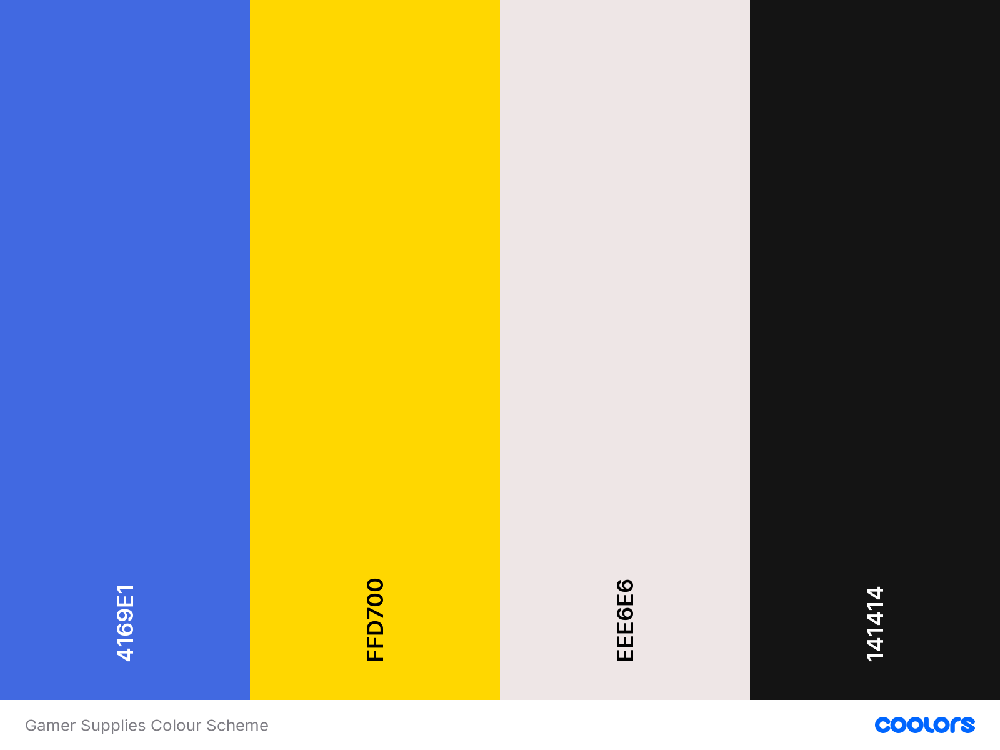
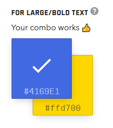
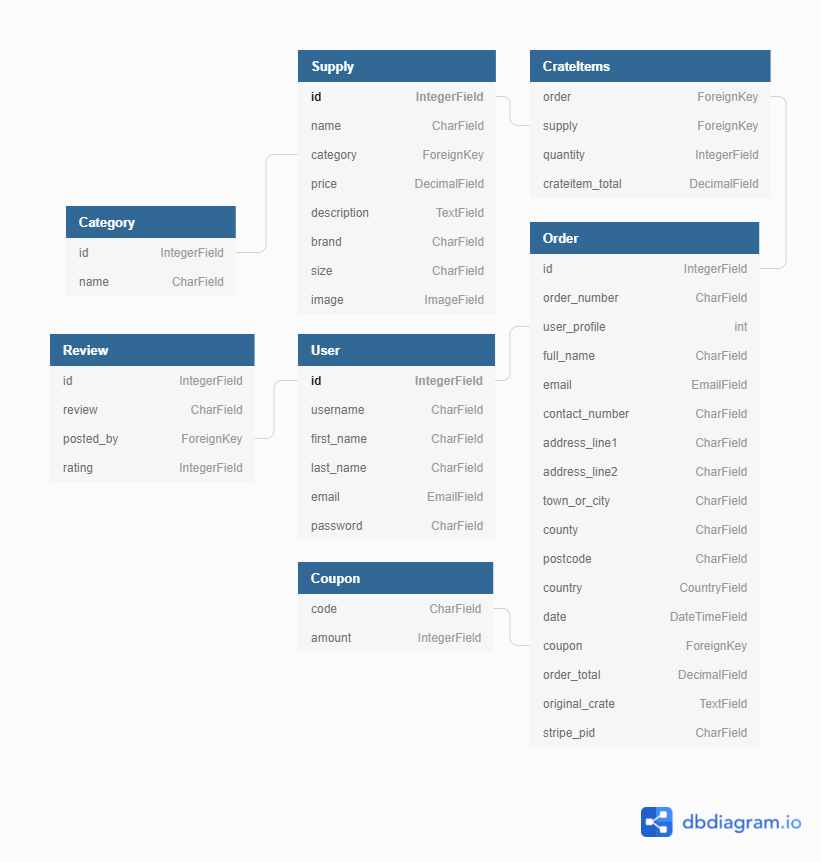

<h1 align="center">Gamer Supplies</h1>

[View a live version of the site here.](https://gamer-supplies.herokuapp.com)

I have created this project (Milestone project 4) as part of my Full Stack Web Development course with [Code Institute](https://codeinstitute.net/).

It is an E-Commerce site for a fictional company 'Gamer Supplies' which offers a variety of snacks for sale.

___

##  Contents

+ [**User Experience Design (UXD)**](<#user-experience-design>)

  + [Project Goals](<#project-goals>)
  + [Content Requirements](<#content-requirements>)
  + [Importance and Feasibility chart](<#importance-and-feasibility-chart>)
  + [User Stories](<#user-stories>)
  + [Website Structure](<#website-structure>)
  + [Design Decisions from UXD](<#design-decisions-from-uxd>)
    + Colour Scheme
    + Images
    + Typography
  + [Wireframes](<#wireframes>)
  + [Design Changes](<#design-changes>)

+ [**Database Schema**](<#database-schema>)

+ [**Features**](#features)

+ [**Technologies**](#technologies)

+ [**Testing**](#testing)

+ [**Deployment**](#deployment)

+ [**Credits**](#credits)
  
___

## User Experience Design

### Project Goals

The goal of this project is to create an MVP (mininum viable product) of an E-Commerce store for a fictional company called 'Gamer Supplies'. The brand motto is ' We provide quality service of Gamer Snacks seamlessly to you'. The site is aimed at gamers looking to stock up on their favourite snacks.

### Content Requirements

+ To provide users with an E-Commerce store that is designed in an user-tailored way to make the process intuitive and seamless.
+ To demonstrate my skills as a full stack web developer using HTML, CSS, JavaScript and Python.
+ To showcase my skills using the Django framework, the modules within it and use of the MVC paradigm.
+ To combine all my previous knowledge on the course into creating an application that looks and runs efficiently.

### Importance and Feasibility chart

Opportunity/Problem | Importance | Viability/Feasibility
:-------- |:--------:|:--------:
A. Users able to register an account and login  | 5 | 5
B. Users can add, edit and remove items from their crate | 5 | 5
C. Users are notified of their actions | 5 | 4
D. Users can re-purchase a past order | 3 | 3
E. Users can search for snacks | 4 | 4

### User stories

#### User goals

+ As a **User**, I want to easily understand the site upon loading it.
+ As a **User**, I want to be able to intuitively navigate the entire site with ease.
+ As a **User**, I want to be able to receive full site functionality on my mobile, tablet and PC.
+ As a **User**, I want to be able to see what supplies are available for purchase on the site.
+ As a **User**, I want to know the prices.
+ As a **User**, I want to be able to seamlessly sign up for an account and receive a confirmation email.
+ As a **User**, I want to read reviews from other users.
+ As a **User**, I want to be able to access the company's associated social media profiles.
+ As a **User**, I want to be able to contact the company with any relevant questions.

#### Registered User goals

+ As a **Registered User**, I want to be able to easily login and logout of my account.
+ As a **Registered User**, I want to be able to easily add and remove items from my supply crate.
+ As a **Registered User**, I want to be able to easily purchase my crate.
+ As a **Registered User**, I want to receive a purchase confirmation email.
+ As a **Registered User**, I want to be able to easily update my contact and delivery information.
+ As a **Registered User**, I want to be able to view my previous orders.
+ As a **Registered User**, I want to be able to add a review about my experience on the site.

#### Site Owner/Superuser goals

+ As a **Site Owner/Superuser**, I want to be able to add new supplies.
+ As a **Site Owner/Superuser**, I want to be able to edit and delete supplies.
+ As a **Site Owner/Superuser**, I want to be able to delete reviews.
+ As a **Site Owner/Superuser**, I want to be able to view and manage all the coupon codes.
+ As a **Site Owner/Superuser**, I want to be able to access the admin section of the site to view orders made, the items they contain and the delivery information.

### Website Structure

The structure of the site is very simple to provide an easy-to-use experience. The header/footer/nav links will remain in the same places across the site but will differ from mobile to other devices as the screen real estate is limited. The header will always contain a link to the supplies page and different links based on whether a user is logged in or a super-user.

#### Other links shown:
+ Not logged in: 
    + Register
    + Login

+ Logged in:
    + **Only as superuser** 
        + Add Supply
        + Manage Reviews
    + My Profile
    + My Crate
    + Logout

###  Design Decisions from UXD

#### Colour Scheme



Using a combination of [coolors.co](https://coolors.co/) and [Accessible Color Generator Tool](https://learnui.design/tools/accessible-color-generator.html) I was able to create a colour scheme that uses contrasting blues and yellows  to convey the majority of the content as it matches the colours used in the brand's logo. The colour scheme will remain consistent throughout the buttons, the overall design of the site and where information is presented back to the user based on their actions. The off-white/off-black will be used for text and information popups.

-  `#4169e1`: Royal Blue
-  `#ffd700`: Gold Web Golden
-  `#eee6e6`: Isabaline
-  `#141414`: Eerie Black

I tested my colour contrasts against the AA guidelines using [this tool](https://learnui.design/tools/accessible-color-generator.html) as mentioned in my technologies section. I have included a picture below as proof:



#### Images

**Back to top/Supply Add button and logo image** - All three of these images are modified versions of a cartoon crate clipart which is licensed for personal use ([source](http://clipart-library.com/clipart/22001.htm)).

| Image | Link |
| :---: | :--: |
| **Logo** | [image](static/images/logo.png) |
| **Add Supply** | [image](static/images/add-supply.png) |
| **Back to Top** | [image](static/images/back-to-top.png) |

**Supply images** - The supply images used for items on the website were taken primarily from [Tesco's website](https://www.tesco.com/). This project is for educational purposes only so the associated credit has been included in the [credits](#credits) section. Supply images used are popular food/drinks that myself, family and friends buy regularly.

#### Typography

Throughout the site two main fonts will be used. 

Headers and titles will use [Saira Stencil One](https://fonts.google.com/specimen/Saira+Stencil+One) and associated text will use [Salsa](https://fonts.google.com/specimen/Salsa).

The Saira Stencil One font was chosen as it resembles stencil lettering such as is used on shipping crates. I felt it an appropriate fit for the purpose of the site as the user fills a Gamer Supply crate. Salsa was chosen as a complimentary font as Google suggested it as a popular pairing with Saira Stencil One and it provides a non obtrusive font to display information across the site.

### Wireframes

| Page | Mobile | Tablet |  PC  |
| :----: |:-----: | :--: | :--: |
| Home | [View](docs/wireframes/mobile-home.png) | [View](docs/wireframes/tablet-home.png) | [View](docs/wireframes/pc-home.png) |
| Register | [View](docs/wireframes/mobile-register.png) | [View](docs/wireframes/tablet-register.png) | [View](docs/wireframes/pc-register.png) |
| Login | [View](docs/wireframes/mobile-login.png) | [View](docs/wireframes/tablet-login.png) | [View](docs/wireframes/pc-login.png) |
| Logout | [View](docs/wireframes/mobile-logout.png) | [View](docs/wireframes/tablet-logout.png) | [View](docs/wireframes/pc-logout.png) |
| Supplies User | [View](docs/wireframes/mobile-suppliesuser.png) | [View](docs/wireframes/tablet-suppliesuser.png) | [View](docs/wireframes/pc-suppliesuser.png) |
| Supplies Admin | [View](docs/wireframes/mobile-suppliesadmin.png) | [View](docs/wireframes/tablet-suppliesadmin.png) | [View](docs/wireframes/pc-suppliesadmin.png) |
| Crate | [View](docs/wireframes/mobile-crate.png) | [View](docs/wireframes/tablet-crate.png) | [View](docs/wireframes/pc-crate.png) |
| Reviews | [View](docs/wireframes/mobile-reviews.png) | [View](docs/wireframes/tablet-reviews.png) | [View](docs/wireframes/pc-reviews.png) |

### Design Changes

**Coupon missing from wireframes**
+ I have added a coupon feature on ```supplies.html``` which is not reflected in the wireframes as this was added to the project later.
    + The reason being I was unsure what to include for my second custom model to satisfy the project requirement. I am aiming for a distinction and as such have included a disclaimer here.

**Sort missing from wireframes**
+ I have added a sort feature on ```supplies.html``` which is not reflected in the wireframes as this was added to the project later.
    + It appears below the category links and expands to a dropdown sorting by Price, Name, Category and Brand (with options for ascending/descending).


**Reviews page without a wireframe**
+ When creating the wireframes I was unsure where I wanted to include reviews that had been posted.
    + I have opted to display them on the homepage and have used templating logic in both the homepage and manage reviews to handle when there are no current reviews displayed.


## Database Schema 

SQLite3 was used in the development of this project as part of the Django framework. Upon deploying, I used Heroku PostGres to handle the database for the production version of the site. The models used to construct the site are outlined below:



I used [dbdiagram.io](https://dbdiagram.io) to create this rendering of the database model and the associated relationships between data sets.

**Supplies App:**

Category Model

| Field | Field Type | Field Options |
| --- | --- | --- |
| name | CharField | max_length=254 |

Supply Model

| Field | Field Type | Field Options |
| --- | --- | --- |
| name | CharField | max_length=254, null=True |
| category | ForeignKey | 'Category', null=True, blank=True, on_delete=models.SET_NULL |
| price | DecimalField | max_digits=6, deciaml_places=2
| description | TextField | null=True, blank=True |
| brand | CharField | max_length=254, null=True, blank=True |
| size | CharField | max_length=25, null=True, blank=True |
| image | ImageField | null=True, blank=True |

Coupon model (Custom model #1 for Distinction performance)

| Field | Field Type | Field Options |
| --- | --- | --- |
| code | CharField | max_length=10, unique=True |
| amount | IntegerField | validators=[MinValueValidator(1),MaxValueValidator(5)] |

**Checkout App:**

Order Model

| Field | Field Type | Field Options |
| --- | --- | ---|
| order_number | CharField | max_length=32, null=False, editable=False |
| user_profile | ForeignKey | UserProfile, on_delete=models.SET_NULL, null=True, blank=False, related_name='orders' |
| full_name | CharField | max_length=80, null=False, blank=False |
| email | EmailField | max_length=254, null=False, blank=False |
| contact_number | CharField | max_length=20, null=True, blank=True |
| address_line_1 | CharField | max_length=50, null=False, blank=False |
| address_line_2 | CharField | max_length=50, null=False, blank=False |
| town_or_city | CharField | max_length=50, null=False, blank=False |
| county | CharField | max_length=50, null=True, blank=True |
| postcode | CharField | max_length=20, null=True, blank=True |
| country | CountryField | blank_label="Country *", null=False, blank=False |
| coupon | ForeignKey | Coupon, on_delete=models.SET_NULL, null=True, blank=True |
| date | DateTimeField | auto_now_add=True |
| order_total | DecimalField | max_digits=10, decimal_places=2, null=False, default=0 |
| original_crate | TextField | null=False, blank=False, default='' |
| stripe_pid | CharField | max_length=254, null=False, blank=False, default='' |

Crate Items Model

| Field | Field Type | Field Options |
| --- | :--- | ---|
| order | ForeignKey | Order, null=False, blank=False, on_delete=models.CASCADE, related_name="crateitems" |
| supply | ForeignKey | Supply, null=False, blank=False, on_delete=models.CASCADE |
| quantity | IntegerField | null=False, blank=False, default=0
| crateitem_total | DecimalField | max_digits=6, decimal_places=2, null=False, blank=False, editable=False

**Profiles App:**

UserProfile Model

| Field | Field Type | Field Options |
| --- | :--- | ---|
| user | OneToOneField | User, on_delete=models.CASCADE |
| default_full_name | CharField | max_length=80, null=True, blank=True |
| default_email | EmailField | max_length=254, null=True, blank=True |
| default_contact_number | CharField | max_length=20, null=True, blank=True |
| default_address_line_1 | CharField | max_length=50, null=True, blank=True |
| default_address_line_2 | CharField | max_length=50, null=True, blank=True |
| default_town_or_city | CharField | max_length=50, null=True, blank=True |
| default_county | CharField | max_length=50, null=True, blank=True |
| default_postcode | CharField | max_length=20, null=True, blank=True |
| default_country = | CountryField | blank_label="Country", null=True, blank=True |

**Reviews App:**

Review Model (Custom model #2 for Distinction performance)

| Field | Field Type | Field Options |
| --- | --- | --- |
| review | TextField | null=True, blank=False |
| added_by | ForeignKey | User, on_delete=models.CASCADE |
| rating | IntegerField | default=0, validators=[MinValueValidator(1),MaxValueValidator(5)] |

#### [Back to top](#contents)

---

## Features

### Existing Features

## Included in the **header** is:

+ **Intuitive navigation**: The navigation bar is located in the same place throughout the site, is easy to use and collapses into a toggle button in mobile view which expands its content.
    + **Brand Icon and Name**: Provides a link to the homepage to allow the user to view it at any point.
    + **Nav Links**: Provides a way for the user to view the other pages on the site.
        + If the user is not logged in they will see Supplies, Register and Login.
        + If the user is logged in they will see Supplies, My Profile, My Crate and Logout.
        + If the user is logged in as a superuser they will see an additional 2 links below Supplies which are: Add Supply and Manage Reviews.

## Included in the **footer** is:

+ **Social media links**: These will take you to the various social media connnections for the company. (Currently the links will point to the homepage for the associated social media site as the brand's socials do not exist at this point in time).

## Included in **index.html** is:

**Website introduction**:
+ Introductory section loads at the top of the page.
    + Contains a tagline with a button to view the snacks in the store.
    + Contains an incentive to create an account as non logged in users do not have access to a crate.

**Reviews**:
+ I used an adapted Bootstrap 5 carousel to display reviews posted to the data store.
    + Carousel will not autoplay and display reviews using a for loop.
    + If the user is logged in they will see an add review button.
    + If the user is logged in as an Admin they will have a manage reviews button below the add review button.

## Included in **supplies.html** is:

**Supplies**
+ A rendered list of cards which contain all the relevant information about the supply from the data store.
    + Image, Name, Description, Size, Brand and Price.

**Supply buttons**
+ Within each card there are multiple buttons based on who is accessing the site.
    + If the user is not logged in they will see Register and Login links below the Supply information.
    + If the user is logged in they will see an Add to Crate and Quantity Adjust buttons.
    + If the user is logged in as a superuser they will see an Add to Crate, Quantity Adjust and Edit/Delete buttons (denoted by relevant icons).

**Supply navigation**
+ A navigation bar which filters the list of supplies based on category filters and sort options which are contained in a dropdown.
+ A search box which allows users to search and match the supply name, description and brand.


## Included in both **crate.html** and **checkout.html** is:

**Quantity adjust buttons**:
+ These buttons are validated using an external file ```quantity_input.html``` in the ```includes``` folder within supplies which allows them to be used across the site.
    + Buttons are set to the correct state on page load and when the input is changed.
    + Buttons are disabled outside of the range 1-99.
    + Buttons adjust the amount of the supply in:
        + ```supplies.html``` before clicking the add to crate button.
        + ```crate.html``` before clicking the update button.


## Included in **crate.html** is:

**Crate total with Coupon field**:
+ A price summary of their crate which updates when a valid coupon is entered.
    + Apply coupon form input where users can enter a 10 character max string.
        + This will then be checked against coupons in the data store when the apply coupon button is clicked and provide the correct result.
            + If the coupon exists, a section containing information of the current coupon and the savings/discount it provides to the user.
            + If the coupon does not exist, the user is returned to the crate without any changes.

**Navigation buttons**:
+ There are two buttons which provide relevant links to the user at the top of the page below the coupon field. These links point to:
    + Browse more snacks - ```supplies.html```
    + Secure checkout - ```checkout.html```

**Crate contents**:
+ Logged in users will see a summary of their crate; if it is empty they will see a button to the supplies page.
    + Included in the crate summary is the amount of supplies in the crate and a list of each item within the crate.
    + On each item within the crate they will see:
        + A summary of the item with an image, name, individual price and a subtotal based on the item quantity.
        + Update/delete and quantity adjust buttons.
        + If the quantity is set to 0 the item is removed from the crate.

## Included in **checkout.html** is:

**Checkout summary and contents**:
+ If the crate is empty they will be redirected to ```supplies.html``` with a message displaying that their crate is empty.
+ Included in the checkout summary is the amount of supplies in the crate and a list of each item within the crate.
+ On each item within the crate they will see:
    + A summary of the item with an image, name, individual price and a subtotal based on the item quantity.
+ The order total is displayed after the list.

**Delivery Information**:
+ A form which allows the user to fill out the relevant fields:
    + Full name, Email, Contact Number, Address Line 1, Address Line 2, Town or City, County, Postcode and Country.
+ A checkbox which allows the user to save their delivery information to their profile which will be preloaded on both the checkout and profile pages thereafter.

**Payment Information**:
+ A form which allows the user to fill out their card information which is verified through Stripe payments and handled using webhooks.

**Form buttons**:
+ There are two buttons which submit the form and provide a relevant link to the user below payment information. These buttons function as follows:
    + Adjust Crate - ```crate.html```
    + Secure checkout - Submits the form and verifies it through Stripe:
        + If successful the user will be redirected to ```checkout_success.html```
            + This page is very similar to the checkout summary page except that there will be an order number and only a singular button is present.
            + If the user is coming from their profile they will see
                + Back to profile - ```profile.html```
                + Got room for more? - ```supplies.html```
        + If unsuccessful the user will be redirected to ```checkout.html``` with an error message displayed, their crate and information intact.

## Included in **profile.html** is:

**Delivery Information**:
+ A form which allows the user to fill out the relevant fields:
    + Full name, Email, Contact Number, Address Line 1, Address Line 2, Town or City, County, Postcode and Country.
+ A button which allows the user to update their delivery information which will be preloaded on both the checkout and profile pages thereafter.

**Order history**:
+ A rendered list from orders linked to the user's profile in the data store which contains a summary of each order. Included in this summary is:
    + Order Number and Date - Auto generated when the order is completed.
    + Order Items - Contains supply name and quantity pertaining to each item on the order.
    + Order Total - Contains the total price of the order.

## These features are included throughout the site and thus do not fall into a specific page

**Bootstrap Toasts**:
+ Bootstrap toasts are prebuilt notifications that are customized to suit the theme of the site, the action that has occured and display relevant messages based on this.
+ These notifications are used throughout the entire site in too many cases to list for each one so I have included the different templates used.
    + For all successful actions ```toast_success.html``` will be used.
    + For all unsuccessful actions ```toast_error.html``` will be used.
    + For all actions that do not fall into either of the previous categories ```toast_info.html``` will be used.


**Account system**:
+ I used [django-allauth](https://django-allauth.readthedocs.io/en/latest/installation.html) to create my account system within the project as it provided prebuilt templates I could style as desired.
    + Users can register with email confirmation, login and logout.

**CRUD Functionality for Registered Users**:
+ Users are able to create, read, update and delete records in the database for the project through various pages and functionality. Included in this are:
    + Supplies - ```add_to_crate```, ```modify_crate``` and ```remove_from_crate``` views providing the associated functionality when the user initates such actions.
        + Activated by: Add To Crate button with quantity inputs on each supply in ```supplies.html```, Update/Delete buttons for each crate item in ```crate.html```.
    + Reviews - ```review_add.html```, ```index.html``` with the delete functionality activating when the associated button is pressed on the homepage.
        + I did not include an edit feature as I felt it would devalue the integrity of the reviews and opted to only include create, read and delete for this feature.
        + Activated by: Add/Delete Review buttons on ```index.html```. 

**CRUD Functionality for admins**:
+ In addition to the previous CRUD functionality, admins are able to create, read, update and delete records in the database for the project through various pages and functionality. Included in this are:
    + Supplies - ```supply_add.html```, ```supplies.html``` and ```supply_edit.html``` with the delete functionality activating when the associated button is pressed.
    + Reviews - ```review_add.html```, ```index.html``` and ```review_manage.html``` with the delete functionality activating when the associated button is pressed.
        + I did not include an edit feature as I felt it would devalue the integrity of the reviews and opted to only include create, read and delete for this feature.
        + Activated by: Add/Manage/Delete review buttons on ```index.html```.
    + Coupons - ```coupons_manage.html```
        + Contains a list of all the current Coupons.
        + Contains a form where admins can add coupons, upon entering successful form information.
        + Contains a delete button on each coupon that activates the delete coupon functionality when pressed.

**Delete conformation modals**
+ When attempting to delete data in the datastore it will initiate a delete confirmation modal.
    + This provides the user with important information about the selected item (Supply, Review and Coupon) to prevent accidental deletions.
    + This functionality is tied to the delete buttons (denoted by relevant icon) in the associated pages (Supplies, Home/Manage Reviews and Manage Coupons)
    + Pictures of these modals can be found within superuser story testing [here](TESTING.MD).

### Features to be added

**Subscription**:
+ I would like the user to be able to order the same crate at a user defined interval (within reason) which would allow for more user options and incentives.
    + Example: If a user orders the same crate 10 times over a certain value they get a 50% discount on their next crate of those items.
    + This would also allow users to receive their favourite snacks whenever they wanted with only having to checkout once.

+ **Pagination** - This would take control if the amount of supplies in the shop went over a threshold. Implementing this fully would require too much work for the time available for this project.

#### [Back to top](#contents)

---

## Technologies

### Languages
+ [HTML](https://en.wikipedia.org/wiki/HTML) - Used as the main language for structuring the website.
+ [CSS](https://en.wikipedia.org/wiki/CSS) - Used as the main language for styling the website.
+ [JavaScript](https://www.javascript.com/) - Used to import and initialize certain functions for use throughout the project.
+ [Python](https://www.python.org) - Used as the main coding language to generate the site, handle the database and user login system.

### Frameworks, libraries and programs
+ [AWS Amazon S3](https://aws.amazon.com/s3/) - Amazon Simple Storage Service (Amazon S3) was used to store media and static files used throughout the project.
+ [Bootstrap](https://getbootstrap.com/docs/5.0/getting-started/introduction/) - A CSS framework that allows for responsive design, prebuilt styling classes and other utlities/components to be applied throughout the entire site.
+ [Django](https://www.djangoproject.com/) - The project was built using Django's web framework.
+ [Djecrety](https://djecrety.ir/) - I used this tool to generate a secret key for Django.
+ [FavIcon](https://favicon.io/) - I used this tool to convert an image I made into icon form and provide the code (stated in HTML comments) to link this icon to base.html.
+ [Font Awesome](https://fontawesome.com/) - I used the Font Awesome icon library to provide icons throughout the site, mainly used for buttons. 
+ [Google Fonts](https://fonts.google.com/) - I used two fonts from the Google fonts library - "Saira Stencil One" and "Salsa".
+ [Git](https://git-scm.com) - Git is an open source version control system where you can commit and push changes to the associated Github repository.
+ [GitHub](https://github.com/) - GitHub was used to store the project code pushed from GitPod using Git.
+ [GitPod](https://gitpod.io) - GitPod was the online IDE (Integrated Development Engine) I used to develop this site.
+ [Heroku](https://dashboard.heroku.com/) - A cloud platform that was used to deploy and run the code pushed to the associated GitHub repository.
+ [jQuery](https://jquery.com/) - I used the jQuery library to provide access to a multitude of functions/methods throughout the site.
+ [Stripe](https://stripe.com/docs) - Stripe was used to integrate an online payment authentication and processing system.

### Documents
+ [Accessible Color Generator](https://learnui.design/tools/accessible-color-generator.html) - I used this tool in conjunction with coolors.co to provide a better colour contrast for accessibility.
+ [Am I Responsive?](http://ami.responsivedesign.is/) - I used this tool to easily display the responsiveness of my site for my README.md introduction.
+ [coolors.co](https://coolors.co) - I used this tool to generate a colour scheme based on the Gamer Supplies logo.
+ [GIMP](https://www.gimp.org) - I used this programme to design the logo/favicon image and wireframes.
+ [Placeholder](https://placeholder.com) - I used this tool to generate colour boxes to display the colour scheme section of my README.md file.

### Dependencies
+ [boto3](https://boto3.amazonaws.com/v1/documentation/api/latest/index.html) - Create, configure, and manage AWS services, such as Amazon Elastic Compute Cloud (Amazon EC2) and Amazon Simple Storage Service (Amazon S3) using the AWS SDK for Python (Boto3).
+ [django-allauth](https://django-allauth.readthedocs.io/en/latest/overview.html)  - Prebuilt Django applications that handle registration, user authentication, account management as well as support for third party accounts.
+ [Django Countries](https://pypi.org/project/django-countries/) - Provides country choices for use with forms and a prebuilt country field for models.
+ [Django Crispy Forms](https://django-crispy-forms.readthedocs.io/en/latest/) - Django tool to programme customizable reusable layouts out of components used within forms.
+ [django-storages](https://django-storages.readthedocs.io/en/latest/) - A collection of Django custom storage backends. 
+ [dj_database_url](https://pypi.org/project/dj-database-url/) - Django utility allows you to configure your Django application to simply utilize the 12factor inspired ```DATABASE_URL``` environment variable.
+ [gunicorn](https://pypi.org/project/gunicorn/) - Python WSGI HTTP Server for UNIX.
+ [Pillow](https://pillow.readthedocs.io/en/stable/) - Imaging library for Python.
+ [psycopg2-binary](https://pypi.org/project/psycopg2-binary/) - PostgreSQL database adapter for Python.
+ [Stripe](https://stripe.com/docs) - Stripe’s API library for Python.

#### [Back to top](#contents)

---

## Testing

I created a separate file for the testing process which can be located [here](TESTING.md).

#### [Back to top](#contents)

---
## Deployment

### Project Inception

1. This project was created using [GitHub](https://github.com) and Code Institute's project template [here](https://github.com/Code-Institute-Org/gitpod-full-template) by clicking "Use this template".
2. I named this project "**gamer-supplies**" as it is the name of company the website is for.
3. Once the repository had been created I clicked the "Gitpod" button which is a Firefox extension ([here](https://addons.mozilla.org/en-GB/firefox/addon/gitpod/)) that creates a workspace within GitPod which is where I developed the project.
4. Following [Code Institute's](https://codeinstitute.net/) lessons the 4 main commands I used were:
    + ```git status``` (which allows me to check which files have been modified and if any are ready to be committed)
    + ```git add .``` (which adds all changed files within my project's directory to be committed)
    + ```git commit -m "[TYPE] Reason"``` (which commits all changes to my project using a category prefix and a specific reason for that commit)
    + ```git push``` (this command pushes all committed changes to the Github repository)

### Deployment to Heroku

Before creating a Heroku app make sure your project has these two files:
+ **requirements.txt** - You can create one by using ```pip3 freeze --local > requirements.txt```
+ **Procfile** - You can create one by using ```echo web: python run.py > Procfile```

**Create application:**
1. Navigate to Heroku's site [here](https://www.heroku.com/).
2. Register and/or Login as applicable.
3. Click on the new button in the top right and select "Create new app".
4. Enter the app name and region closest to you.
5. Click the create app button.

**Set environment variables:**
1. Click on the settings tab and then click "Reveal config vars".
2. Config variables added throughout project:

    | Key | Value |
    | :-: | :---: |
    | AWS_ACCESS_KEY_ID | Your AWS_ACCESS_KEY_ID |
    | AWS_SECRET_ACCESS_KEY | Your AWS_SECRET_ACCESS_KEY |
    | DATABASE_URL | Your DATABASE_URL |
    | EMAIL_HOST_PASS | Your EMAIL_HOST_PASS |
    | EMAIL_HOST_USER | Your EMAIL_HOST_USER |
    | SECRET_KEY | Your SECRET_KEY |
    | STRIPE_PUBLIC_KEY_GS | Your STRIPE_PUBLIC_KEY |
    | STRIPE_SECRET_KEY_GS | Your STRIPE_SECRET_KEY |
    | STRIPE_WH_SECRET_GS | Your STRIPE_WH_SECRET |
    | USE_AWS | True |

**Setting up database in deployment**
1. Temporarily add the ```DATABASE_URL``` to ```settings.py```:

    ```bash
    DATABASES = {
    'default': dj_database_url.parse('your_postgres_database_url')
    }
    ```
2. Migrate the data from development to production version.
    + To migrate the database models in the project to the Postgres database you can use the following command:

        ```python3 manage.py migrate```

    + To load the data within fixtures use the following command:

        ```python3 manage.py loaddata <fixture_name>```
        
        **IMPORTANT**: Load categories fixtures then supplies (supplies are dependent on categories).

    + To create a fixture from your current data store you can use the following command:

        ```python3 manage.py dumpdata --app_name.model_name --indent yourindentlength > fixtures_name.json```

3. You will then need a superuser for the Postgres database too. To create one you can use the following command:
    
    ```python3 manage.py createsuperuser```

4. Remove the Postgres database URL from settings.py as this should not in any case be deployed to GitHub for security reasons.
5. To connect your Heroku app to be deployed from a Github repository, you can follow these steps:
    1. Open the heroku app page on the deploy tab and select GitHub - Connect to GitHub.
    2. Sign into GitHub if not already.
    3. A prompt to find a Github repository to connect to will then be displayed.
    4. Enter the repository name for the project and click search.
    5. Once the repository has been found, click the connect button.
6. Once you have your GitHub repository connected, without leaving deploy tab:
    1. Under Automatic deploys section, choose the branch you want to deploy from and then click the "**Enable Automatic Deploys**" button.
    2. To deploy your app to Heroku click the **"Deploy Branch"** button.

### Setting up AWS Amazon S3 Bucket

To setup static and media files in an Amazon S3 Bucket follow these steps:
1. If you do not own one already create or login to your [AWS](https://aws.amazon.com/) account.
2. Click on My Account (top right) and open the AWS Management Console page.
3. Search for S3 in the Services section (top left) and create a new bucket with the following settings:
    1. An appropriate name (your project name).
    2. Region (closest to you).
    3. **Uncheck Block all Public Access**.
    4. Open the new bucket and **Enable Static Website Hosting** (bottom of page).
    5. In the permissions tab, edit the **CORS configuration** (near bottom) and use the following code to set up the required connection between the Heroku app and the bucket:

        ```bash
        [
            {
                "AllowedHeaders": [
                    "Authorization"
                ],
                "AllowedMethods": [
                    "GET"
                ],
                "AllowedOrigins": [
                    "*"
                ],
                "ExposeHeaders": []
            }
        ]
        ```
    6. In the permissions tab, click Edit on the Bucket Policy and open the policy generator.
    7. Use the following settings to setup the policy correctly:
        + Type of Policy: **"S3 Bucket Policy"**
        + Principal: **"*"**
        + Action: **"GetObject"**
        + ARN: This can be found on the Edit Bucket Policy page
        + **Add the statement**
        + **Generate the policy**
    8. Copy the generated policy into the Policy section on the Edit Bucket Policy page.
        + **IMPORTANT**: Add **"/*"** to the end of the resource key to ensure all files are loaded.

### Creating a local clone

**Disclaimer**: This project will not run locally with database connections unless you set the Heroku config variables in your IDE. The information used to run this project is private and has not been pushed to the GitHub repository for this reason.

Once you have done the above you can follow these steps to create a local copy on your computer:
1. Navigate to the GitHub Repository for the project [here](https://github.com/JoeyyScott/gamer-supplies/).
2. Click the Code drop down button.
3. From here there are two options:
    + Either unpackage locally/download as a ZIP file then open with your preferred IDE.
    + Copy the Git URL from the HTTPS field.

4. If you chose to copy the Git URL then follow these additional steps:
    1. Open a terminal window on your computer (or in your preferred IDE) in a directory of your choice.
    2. In the terminal window type  ```git clone https://github.com/JoeyyScott/gamer-supplies.git``` and press enter to confirm.
    3. This will create a local clone of the project in your chosen directory.
    
5. For the project to function fully you must install the required dependencies from "requirements.txt" using the following command:
    
    ```pip3 install requirements.txt```

6. To run the app in your local IDE type ```python3 manage.py runserver```.

#### [Back to top](#contents)

---

## Credits

### Content

This section includes areas/sections of code and properties I was unaware of. I have also included sources from where I have adapted/changed code used in the projects throughout my course as I figured it was better practice to state as such to avoid any penalizations or copyright violations.

**Bootstrap Documentation**: [Source](https://getbootstrap.com/docs/5.0/getting-started/introduction/)
+ I used the Bootstrap Documentation to add different components to the project most notably a Navbar, Nav Tabs, Toasts, Modal, Carousel, Collapse and Cards.
+ I used various built in Bootstrap classes to style different elements to the needs of the project most notably margins, padding and text positioning.

**Full Stack Frameworks Boutique Ado Project with [Code Institute](https://codeinstitute.net/)**
+ The Boutique Ado walkthrough project created during the course was used as a guide to build the structure of this application. You can view the source code for that project [here](https://github.com/Code-Institute-Solutions/boutique_ado_v1).
    + Most notably the section on creating fully functioning Stripe Webhooks as this was something I had not heard of until undertaking the walkthrough project.
+ Through the development of this project I have tried to create a website that was entirely different to Boutique Ado despite it providing the basis of my understanding of Django as well as working with Stripe.

**Quantity Input Script (```quantity-input.js```)**:
+ The code primarily used was from ```quantity_input_script.html``` in the Boutique Ado project and I have adapted it to suit my needs for this project.
    + I put this code into a static JS file in the Supplies app as per the distinction performance for splitting code into relevant files and received no functionality issues.
    + [Quantity Input Script](https://github.com/Code-Institute-Solutions/boutique_ado_v1/blob/master/products/templates/products/includes/quantity_input_script.html)
        + To provide appropriate credit for this code I have included the current link to the file in question from [Code Institute Solutions Github](https://github.com/Code-Institute-Solutions).

**Quantity update/delete inline JS in ```crate.html```**:
+ The code primarily used was from ```bag.html``` in the Boutique Ado project and I have adapted it to suit my needs for this project.
+ The code that handles the quantity update/delete features I have since included in a block (``````) after the content block in ```crate.html```.
    + I wanted to include this in a JS file in the static directory for the crate app as per the distinction performance for splitting code into relevant files.
    + When attempting to do this the delete functionality would not work.
        + I consulted with the [Code Institute](https://codeinstitute.net/) Slack community and was told to leave it in ```crate.html``` and state it in the README which is what I have done here.
        + This reason it breaks is due to the ```csrf_token``` not being recognised when this code exists outside of ```crate.html``` and as such I have opted to leave it in the HTML file due to time constraints as I have been told the latter would require a lot more time to implement. I felt breaking the delete functionality entirely was not worth having a static JS file in this one case.
        + [Quantity Update/Delete Script](https://github.com/Code-Institute-Solutions/boutique_ado_v1/blob/master/bag/templates/bag/bag.html)
            + To provide appropriate credit for this code I have included the current link to the file in question from [Code Institute Solutions Github](https://github.com/Code-Institute-Solutions).

**Sending HTML through django messages and templates**:
+ I wanted to customize my Django messages and tried various solutions I found from researching the issue.
    + The one that worked for me was [this post](https://stackoverflow.com/questions/58415186/how-to-make-a-new-line-in-django-messages-error) which uses "mark safe" from Django's built in utilities.

**TypedChoiceField**:
+ I was looking around for how to display the ratings on my reviews and after looking on [here](https://docs.djangoproject.com/en/3.2/ref/forms/fields/) I decided to use either TypedChoiceField or ChoiceField and when looking for how to set it up I found [this post](https://stackoverflow.com/questions/3673833/typedchoicefield-or-choicefield-in-django) which provided a basic structure which I adapted for my reviews ```forms.py``` file.

**Inner carousel for loop**:
+ When developing this project I encountered a bug in my Bootstrap carousel (details in [TESTING.md](TESTING.md))
+ I found [this post](https://stackoverflow.com/questions/35836879/how-to-use-for-loop-with-bootstrap-carousel) which solved my issue using the following code:
    + ```active```

**Inner carousel scrollbar**:
+ I wanted my review carousel to be a fixed height and set ```overflow: scroll``` on the element.
    + This caused a scrollbar to appear and after searching around I found [this post](https://www.w3schools.com/howto/howto_css_hide_scrollbars.asp) which provided me with the CSS rules to hide the scrollbar but keep the functionality.
    + I have included the snippet below:

        ```css
         /* Hide scrollbar for Chrome, Safari and Opera */
        .example::-webkit-scrollbar {
            display: none;
        }

        /* Hide scrollbar for IE, Edge and Firefox */
        .example {
            -ms-overflow-style: none;  /* IE and Edge */
            scrollbar-width: none;  /* Firefox */
        }

**Hiding +/- buttons on number input field**:
+ I wanted to use my own quantity input buttons and when viewing the site on small screens you were unable to fully view the number in the field. After searching around I found [this post](https://www.w3schools.com/howto/howto_css_hide_arrow_number.asp) which provided me with the CSS rules to hide the up/down arrows on the input.
    + I have included the snippet below:

        ```css
        /* Chrome, Safari, Edge, Opera */
        input::-webkit-outer-spin-button,
        input::-webkit-inner-spin-button {
            -webkit-appearance: none;
            margin: 0;
        }

        /* Firefox */
        input[type=number] {
            -moz-appearance: textfield;
        }

**Redirecting after adding to crate**:
+ Originally I had this feature using:

    ```request.POST.get('redirect_url')```

    but when using the site in development I noticed when adding items to your crate it would clear your previous search/category filter/sorting whereas I wanted to return users to the page before pressing the button.
    + After searching around I found [this post](https://stackoverflow.com/questions/44151339/python-django-how-to-get-the-page-url-before-navigating-to-a-new-view) which utilized the following code:
    
        ```request.META.get('HTTP_REFERER')```
     
    + I set ```redirect_url``` to this value and the view functioned as intended.

**Scroll to top button**:
+ In searching how to detect if a user was scrolling and returning the amount I found [this post](https://css-tricks.com/how-to-make-an-unobtrusive-scroll-to-top-button/) which utilized the following code:

    ```javascript
    var rootElement = document.documentElement

    function handleScroll() {
        // Do something on scroll
        var scrollTotal = rootElement.scrollHeight - rootElement.clientHeight
        if ((rootElement.scrollTop / scrollTotal ) > 0.80 ) {
            // Show button
            scrollToTopBtn.classList.add("showBtn")
        } else {
            // Hide button
            scrollToTopBtn.classList.remove("showBtn")
        }
    }

    document.addEventListener("scroll", handleScroll)
    ```
+ I was able to utilize, ```document.documentElement```, ```scrollTop``` and the event listener to create a script to detect if the user had scrolled past a point (found using console logs) to take the relevant action with the back to top button:

    ```javascript
    document.addEventListener("scroll", function () { 
        var btt = document.getElementById('trigger-btt')
        if (page.scrollTop > 290) { btt.classList.remove('hidden'); } else { btt.classList.add('hidden'); }
    })

**Ordering a queryset in Django**:
+ After deploying my application to Heroku when editing supplies the order showed on "All Supplies" would default to the most recently edited being the last in the list.
    + I realized I had to sort them by the primary key attached to the Supplies in the data store.
    + After searching around I found [this post](https://books.agiliq.com/projects/django-orm-cookbook/en/latest/asc_or_desc.html) which utilized the ```order_by``` function within Django objects and showed how to set parameters.
    + Using this function ensured the Supplies were loaded in the correct order and were unaffected by being edited.

**Initializing Toasts**:
+ I ended up upgrading my Bootstrap version to 5 and this caused my toasts to not be initialized.
    + After a quick google search I was able to find [this post](https://stackoverflow.com/questions/63515279/how-to-initialize-toasts-with-javascript-in-bootstrap-5) which utilized the following code:

        ```javascript
        var toastElList = [].slice.call(document.querySelectorAll('.toast'))
        var toastList = toastElList.map(function(toastEl) {
        // Creates an array of toasts (it only initializes them)
          return new bootstrap.Toast(toastEl) // No need for options; use the default options
        });
       toastList.forEach(toast => toast.show()); // This show them
       ```
    + Upon using this my toasts again showed as intended.

**Setting FavIcon in Django admin**:
+ Throughout the development of the project I kept noticing that the icon was not loading whenever in the admin.
+ After a quick google search on how to set it I found [this post](https://stackoverflow.com/questions/34959897/set-favicon-in-django-admin) which utilized the following code and overriding the template it uses:

    ```
    

    {{ title }} | {{ site_title|default:_('Django site admin') }}

    
        <link rel="icon" href="{{STATIC_URL}}img/favicon.ico" sizes="48x48" />
    
    
        <h1 id="site-name"><a href="">{{ site_header|default:_('Django administration') }}</a></h1>
    
    ```
+ I adapted this template to create ```base_site.html``` and set the FavIcon correctly.

**Setting minimum value for value in forms.py**:
+ When implementing the Add Coupon functionality I was able to add coupons with an amount of 0.
+ I began searching around and found [this post](https://stackoverflow.com/questions/41701222/django-modelform-setting-minimum-value-on-floatfield) which utilized the following code:

    ```python
    def clean_price(self):
        price = self.cleaned_data['price']
        if price < 0.01:
            raise forms.ValidationError("Price cannot be less than 0.01")
        return price
    ```

+ I was able to modify this to suit my needs of checking if the amount entered was under 1.
    + If an amount under 1 is entered the user receives an error toast and returned to ```coupon_manage.html```.

    ```python
    def clean_amount(self):
        amount = self.cleaned_data['amount']
        if amount < 1:
            raise forms.ValidationError("Amount cannot be less than 1")
        return amount

**Adding slide effect to Bootstrap dropdown**:
+ I implemented the admin nav links to sit in a dropdown menu within the main navigation.
    + This functioned as intended but the animation looked choppy. After a quick google search I found [this post](https://stackoverflow.com/questions/12115833/adding-a-slide-effect-to-bootstrap-dropdown) which utilized the following code:

        ```javascript
        // Add slideDown animation to Bootstrap dropdown when expanding.
        $('.dropdown').on('show.bs.dropdown', function() {
            $(this).find('.dropdown-menu').first().stop(true, true).slideDown();
        });

        // Add slideUp animation to Bootstrap dropdown when collapsing.
        $('.dropdown').on('hide.bs.dropdown', function() {
            $(this).find('.dropdown-menu').first().stop(true, true).slideUp();
        });

    + After adding this code to an external file ```dropdown.js``` the desired effect was achieved.

### Media

#### Images

**Disclaimer**: This project is for educational purposes **only** and as such images for the supplies in the store have been sourced from various locations as finding royalty free images of these items proved fruitless.

I have included links to all the supply images below:

**Drinks**
|     Name      | Image |
| :-----------: | :---: |
| **Yazoos 1L** |
| Banana | [image](https://www.tesco.com/groceries/en-GB/products/251328672) |
| Strawberry | [image](https://www.tesco.com/groceries/en-GB/products/258836704) |
| Chocolate orange | [image](https://www.tesco.com/groceries/en-GB/products/309470465) |
| **Soft Drinks** |
| Diet Coke 1.25L | [image](https://www.tesco.com/groceries/en-GB/products/252047858) |
| Fanta Fruit Twist 2L | [image](https://www.tesco.com/groceries/en-GB/products/253127100) |
| Dr Pepper 2L | [image](https://www.tesco.com/groceries/en-GB/products/259059292) |
| **Volvic 1.5L** |
| Strawberry | [image](https://www.tesco.com/groceries/en-GB/products/256917071) |
| Mango | [image](https://www.tesco.com/groceries/en-GB/products/304791679) |
| Watermelon | [image](https://www.tesco.com/groceries/en-GB/products/298161813) |
| **Tropicana** |
| Pineapple 850ml | [image](https://www.tesco.com/groceries/en-GB/products/287294534) |
| Apple 950ml | [image](https://www.tesco.com/groceries/en-GB/products/296050585) |
| Tropical 850ml | [image](https://www.tesco.com/groceries/en-GB/products/287295032) |

**Sweet**

+ Note: The link for Wispa 4 pack points to a product that is no longer on the Tesco's website.
    + I have opted to leave the link in and include pictures of my google searches as proof the website existed at the time I saved the image.
        | File | Image |
        | :--: | :---: |
        | Google images | [image](docs/images/wispacredit.png) |
        | Google search | [image](docs/images/wispacredit2.png) |

|    Name    | Image |
| :--------: | :---: |
| Wispa 4 pack | [image](https://www.tesco.com/groceries/en-GB/products/283787257) |
| Dairy Milk Caramel 4 pack | [image](https://www.tesco.com/groceries/en-GB/products/292215265) |
| Snickers 4 pack | [image](https://www.tesco.com/groceries/en-GB/products/287853000) |
| **Haribo** |
| Tangfastics 175g | [image](https://www.tesco.com/groceries/en-GB/products/308487211) |
| Giant strawbs 175g | [image](https://www.tesco.com/groceries/en-GB/products/307747545) |
| **Misc Sweet** |
| Squashies Drumsticks 175g | [image](https://www.tesco.com/groceries/en-GB/products/297319492) |
| Maryland Minis 6 pack | [image](https://www.tesco.com/groceries/en-GB/products/304391537) |
| Maryland Minis Double Chocolate 6 pack | [image](https://www.tesco.com/groceries/en-GB/products/304397295) |
| Mini Fingers Snack 6 pack | [image](https://www.tesco.com/groceries/en-GB/products/304403652) |
| Caramel Wafer 8 pack | [image](https://www.tesco.com/groceries/en-GB/products/255526609) |
| Caramel Rice Krispie Squares 4 pack | [image](https://www.tesco.com/groceries/en-GB/products/250202816) |
| Iced Gems 6 pack | [image](https://www.tesco.com/groceries/en-GB/products/302295234) |

**Savoury**
|       Name       | Image |
| :--------------: | :---: |
| **Misc Savoury** |
| Mini Cheddars Red Leicester 6 Pack | [image](https://www.tesco.com/groceries/en-GB/products/301063891) |
| Bacon Frazzles 8 Pack | [image](https://www.tesco.com/groceries/en-GB/products/292250078) |
| Wotsits 6 Pack | [image](https://www.tesco.com/groceries/en-GB/products/254423859) |
| Ritz Breaks 6 Pack | [image](https://www.tesco.com/groceries/en-GB/products/283249434) |
| Peperami 5 Pack | [image](https://www.tesco.com/groceries/en-GB/products/296526864) |
| Butterkist Microwave Salted Popcorn | [image](https://www.tesco.com/groceries/en-GB/products/303543090) |
| Hearty Sausage Roll 4 pack | [image](https://www.tesco.com/groceries/en-GB/products/305956208) |
| Snack Melton Mowbray Pork Pies 6 pack | [image](https://www.tesco.com/groceries/en-GB/products/254387918) |
| 35 Mini Scotch Eggs | [image](https://www.tesco.com/groceries/en-GB/products/273466094) |
| **Pot noodles 114g** |
| Sticky Rib | [image](https://www.tesco.com/groceries/en-GB/products/293396917) |
| Bombay Bad Boy | [image](https://www.tesco.com/groceries/en-GB/products/260188598) |
| Chicken & Mushroom | [image](https://www.tesco.com/groceries/en-GB/products/260135097) |

**Healthy**
|    Name    | Image |
| :--------: | :---: |
| **Fruit Bowl Peelers 4 pack** |
| Strawberry | [image](https://www.tesco.com/groceries/en-GB/products/292311312) |
| Blackcurrant | [image](https://www.tesco.com/groceries/en-GB/products/292311479) |
| Raspberry | [image](https://www.tesco.com/groceries/en-GB/products/292311652) |
| **Winders** |
| Double Apple and Strawberry 5 pack | [image](https://www.tesco.com/groceries/en-GB/products/309163190) |
| Strawberry 5 pack | [image](https://www.tesco.com/groceries/en-GB/products/309188051) |
| Double Strawberry and Blackcurrant 6 pack | [image](https://www.amazon.co.uk/Kelloggs-Winders-Doubles-Strawberry-Blackcurrant/dp/B00XTX3FD4) |
| **Misc healthy** |
| Chewy Banana | [image](https://www.tesco.com/groceries/en-GB/products/262346986) |
| Peanuts and Raisins | [image](https://www.tesco.com/groceries/en-GB/products/276377586) |
| Apple Slices | [image](https://www.tesco.com/groceries/en-GB/products/262290526) |
| **GoAhead 5 pack** |
| Apple & Sultana | [image](https://www.tesco.com/groceries/en-GB/products/283420093) |
| Forest Fruit | [image](https://www.tesco.com/groceries/en-GB/products/283419585) |
| Raspberry | [image](https://www.tesco.com/groceries/en-GB/products/283419441) |

### Acknowledgements

#### [Back to top](#contents)

---