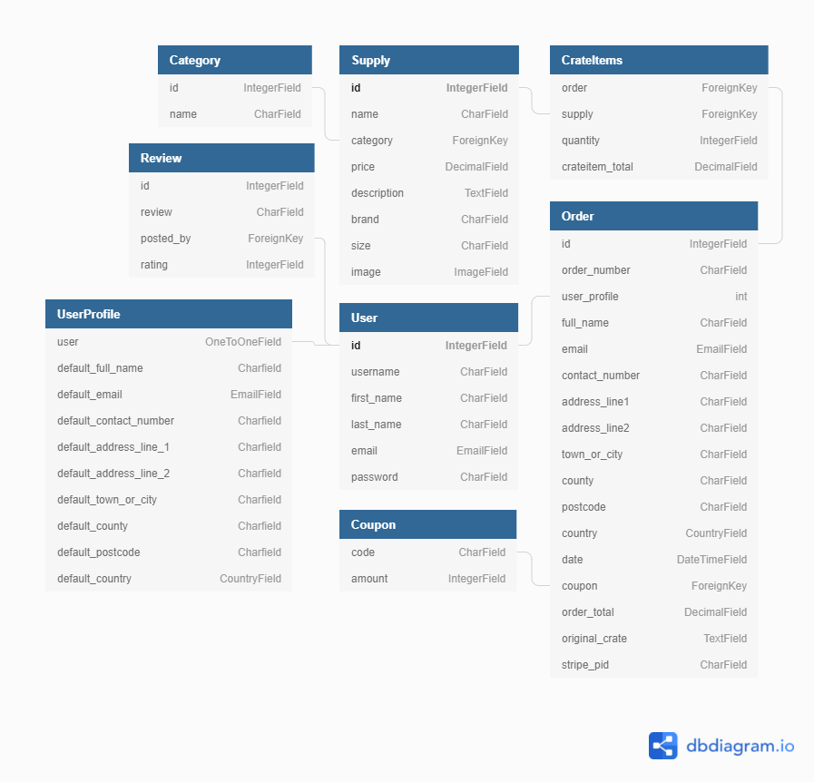

<h1 align="center">Gamer Supplies</h1>

[View a live version of the site here.]()

I have created this project (Milestone project 4) as part of my Full Stack Web Development course with [Code Institute](https://codeinstitute.net/).

It is an E-Commerce site for a fictional company 'Gamer Supplies' which offers a variety of snacks for sale.

___

## Contents

+ [**User Experience Design (UXD)**](<#user-experience-design>)

  + [Project Goals](<#project-goals>)
  + [Content Requirements](<#content-requirements>)
  + [Importance and Feasibility chart](<#importance-and-feasibility-chart>)
  + [User Stories](<#user-stories>)
  + [Website Structure](<#website-structure>)
  + [Design Decisions from UXD](<#design-decisions-from-uxd>)
    + Colour Scheme
    + Images
    + Typography
  + [Wireframes](<#wireframes>)
  + [Design Changes](<#design-changes>)

+ [**Database Schema**](<#database-schema>)

+ [**Features**](#features)

+ [**Technologies**](#technologies)

+ [**Testing**](#testing)

+ [**Deployment**](#deployment)

+ [**Credits**](#credits)
  
___

## User Experience Design

### Project Goals

The goal of this project is to create an MVP (mininum viable product) of an E-Commerce store for a fictional company called 'Gamer Supplies'. The brand motto is ' We provide quality service of Gamer Snacks seamlessly to you'. The site is aimed at gamers looking to stock up on their favourite snacks.

### Content Requirements

+ To provide users with an E-Commerce store that is designed in an user-tailored way to make the process intuitive and seamless.
+ To demonstrate my skills as a full stack web developer using HTML, CSS, JavaScript and Python.
+ To showcase my skills using the Django framework, the modules within it and use of the MVC paradigm.
+ To combine all my previous knowledge on the course into creating an application that looks and runs efficiently.

### Importance and Feasibility chart

Opportunity/Problem | Importance | Viability/Feasibility
:-------- |:--------:|:--------:
A. Users able to register an account and login  | 5 | 5
B. Users can add/edit and remove items from their crate | 5 | 5
C. Users are notified of their actions | 5 | 4
D. Users can re-purchase a past order | 3 | 3
E. Users can search for snacks | 4 | 4

### User stories

#### User goals

+ As a **User**, I want to easily understand the site upon loading it.
+ As a **User**, I want to be able to intuitively navigate the entire site with ease.
+ As a **User**, I want to be able to receive full site functionality on my phone and tablet.
+ As a **User**, I want to be able to see what supplies are available for purchase on the site.
+ As a **User**, I want to know the prices.
+ As a **User**, I want to be able to seamlessly sign up for an account and receive a confirmation email.
+ As a **User**, I want to be able to access the companies associated social media profiles.
+ As a **User**, I want to be able to contact the company with any relevant questions.

#### Registered User goals

+ As a **Registered User**, I want to be able to easily login and logout of my account
+ As a **Registered User**, I want to be able to easily add and remove items from my supply crate.
+ As a **Registered User**, I want to be able to easily purchase my crate.
+ As a **Registered User**, I want to receive a purchase confirmation email.
+ As a **Registered User**, I want to be able to easily update my contact and delivery information.
+ As a **Registered User**, I want to be able to view my previous orders.

#### Site Owner/Superuser goals

+ As a **Site Owner/Superuser**, I want to be able to add new supplies
+ As a **Site Owner/Superuser**, I want to be able to edit and delete supplies
+ As a **Site Owner/Superuser**, I want to be able to access the admin section of the site to view orders made, the items they contain and the delivery information.

### Website Structure

The structure of the site is very simple to provide an easy-to-use experience. The header/footer/nav links will remain in the same places across the site but will differ from mobile to other devices as the screen real estate is limited. In the header will always contain a link to the supplies page and different links based on whether a user is logged in or a super-user.

| Other links shown |
:-------------------------------:
+ Not logged in: 
    + Register
    + Login

+ Logged in:
    + **Only as superuser** 
        + Add Supply
        + Manage Reviews
    + My Profile
    + My Crate
    + Logout

###  Design Decisions from UXD

#### Colour Scheme


Using a combination of [coolors.co](https://coolors.co/) and [Accessible Color Generator Tool](https://learnui.design/tools/accessible-color-generator.html) I was able to create a colour scheme that uses contrasting blues and yellows  to convey the majority of the content as it matches the colours used in the brand's logo. The colour scheme will remain consistent throughout the buttons, the overall design of the site and where information is presented back to the user based on their actions. The offwhite/offblack will be used for text and information popups.

-  `#4169e1`: Royal Blue
-  `#ffd700`: Gold Web Golden
-  `#eee6e6`: Isabaline
-  `#141414`: Eerie Black

I tested my colour contrasts against the AA guidelines using [this tool](https://learnui.design/tools/accessible-color-generator.html) as mentioned in my technologies section. I have included a picture below as proof:


#### Images

**Logo image** - This is a modified version of a cartoon crate clipart which is licensed for personal use ([source](http://clipart-library.com/clipart/22001.htm)).


#### Typography

Throughout the site two main fonts will be used. 

Headers and titles will use [Saira Stencil One](https://fonts.google.com/specimen/Saira+Stencil+One) and associated text will use [Salsa](https://fonts.google.com/specimen/Salsa).

The Saira Stencil One font was chosen as it resembles stencil lettering such as is used on shipping crates. I felt it an appropriate fit for the purpose of the site as the user fills a Gamer Supply crate. Salsa was chosen as a complimentary font as Google suggested it as a popular pairing with Saira Stencil One and it provides a non obtrusive font to display information across the site.

### Wireframes

| Page | Mobile | Tablet |  PC  |
| :----: |:-----: | :--: | :--: |
| Home | [View](docs/wireframes/mobile-home.png) | [View](docs/wireframes/tablet-home.png) | [View](docs/wireframes/pc-home.png) |
| Register | [View](docs/wireframes/mobile-register.png) | [View](docs/wireframes/tablet-register.png) | [View](docs/wireframes/pc-register.png) |
| Login | [View](docs/wireframes/mobile-login.png) | [View](docs/wireframes/tablet-login.png) | [View](docs/wireframes/pc-login.png) |
| Logout | [View](docs/wireframes/mobile-logout.png) | [View](docs/wireframes/tablet-logout.png) | [View](docs/wireframes/pc-logout.png) |
| Supplies User | [View](docs/wireframes/mobile-suppliesuser.png) | [View](docs/wireframes/tablet-suppliesuser.png) | [View](docs/wireframes/pc-suppliesuser.png) |
| Supplies Admin | [View](docs/wireframes/mobile-suppliesadmin.png) | [View](docs/wireframes/tablet-suppliesadmin.png) | [View](docs/wireframes/pc-suppliesadmin.png) |
| Crate | [View](docs/wireframes/mobile-crate.png) | [View](docs/wireframes/tablet-crate.png) | [View](docs/wireframes/pc-crate.png) |
| Reviews | [View](docs/wireframes/mobile-reviews.png) | [View](docs/wireframes/tablet-reviews.png) | [View](docs/wireframes/pc-reviews.png) |


### Design Changes

**Coupon missing from wireframes**
+ I've added a coupon feature which isn't reflected in the wireframes as this was added into the project later.
    + The reason being I was unsure what to include for my second custom model to satisfy the project requirement. I'm aiming for a distinction and as such have included a disclaimer here.

**Reviews page without a wireframe**
+ When creating the wireframes I was unsure where I wanted to include reviews that had been posted.
    + I have opted to display them on the homepage and have used templating logic in both the homepage and manage reviews to handle there being no current reviews.


## Database Schema 

SQLite3 was used in the development of this project as part of the Django framework. Upon deploying, I used Heroku PostGres to handle the database for the production version of the site. The models used to construct the site are outlined below:



I used [dbdiagram.io](dbdiagram.io) to create this rendering of the database model and the associated relationships between data sets.

**Supplies App:**

Category Model

| Field | Field Type | Field Options |
| --- | --- | --- |
| name | CharField | max_length=254 |

Supply Model

| Field | Field Type | Field Options |
| --- | --- | --- |
| name | CharField | max_length=254, null=True |
| category | ForeignKey | 'Category', null=True, blank=True, on_delete=models.SET_NULL |
| price | DecimalField | max_digits=6, deciaml_places=2
| description | TextField | null=True, blank=True |
| brand | CharField | max_length=254, null=True, blank=True |
| size | CharField | max_length=25, null=True, blank=True |
| image | ImageField | null=True, blank=True |

Coupon model

| Field | Field Type | Field Options |
| --- | --- | --- |
| code | CharField | max_length=10, unique=True |
| amount | IntegerField | validators=[MinValueValidator(1),MaxValueValidator(5)] |

**Checkout App:**

Order Model

| Field | Field Type | Field Options |
| --- | --- | ---|
| order_number | CharField | max_length=32, null=False, editable=False |
| user_profile | ForeignKey | UserProfile, on_delete=models.SET_NULL, null=True, blank=False, related_name='orders' |
| full_name | CharField | max_length=80, null=False, blank=False |
| email | EmailField | max_length=254, null=False, blank=False |
| contact_number | CharField | max_length=20, null=True, blank=True |
| address_line_1 | CharField | max_length=50, null=False, blank=False |
| address_line_2 | CharField | max_length=50, null=False, blank=False |
| town_or_city | CharField | max_length=50, null=False, blank=False |
| county | CharField | max_length=50, null=True, blank=True |
| postcode | CharField | max_length=20, null=True, blank=True |
| country | CountryField | blank_label="Country *", null=False, blank=False |
| date | DateTimeField | auto_now_add=True |
| order_total | DecimalField | max_digits=10, decimal_places=2, null=False, default=0 |
| original_crate | TextField | null=False, blank=False, default='' |
| stripe_pid | CharField | max_length=254, null=False, blank=False, default='' |

Crate Items Model

| Field | Field Type | Field Options |
| --- | :--- | ---|
| order | ForeignKey | Order, null=False, blank=False, on_delete=models.CASCADE, related_name="crateitems" |
| supply | ForeignKey | Supply, null=False, blank=False, on_delete=models.CASCADE |
| quantity | IntegerField | null=False, blank=False, default=0
| crateitem_total | DecimalField | max_digits=6, decimal_places=2, null=False, blank=False, editable=False

**Reviews App:**

Review Model

| Field | Field Type | Field Options |
| --- | --- | --- |
| review | TextField | null=True, blank=False |
| added_by | ForeignKey | User, on_delete=models.CASCADE |
| rating | IntegerField | default=0, validators=[MinValueValidator(1),MaxValueValidator(5)] |

#### [Back to top](#contents)

---

## Features

### Existing Features

Included in the **header** is: 

+ **Intuitive navigation**: The navigation bar is located in the same place throughout the site, is easy to use and collapses into a toggle button in mobile view which expands its content.
    + **Brand Icon and Name**: Provides a link to the homepage to allow the user to view it at any point.
    + **Nav Links**: Provides a way for the user to view the other pages on the site.
        + If the user is not logged in they will see Supplies, Register and Login.
        + If the user is logged in they will see Supplies, My Profile, My Crate and Logout.
        + If the user is logged in as a superuser they will see an additional 2 links below Supplies which are: Add Supply and Manage Reviews.

Included in the **footer** is:

+ **Social media links**: These will take you to the various social media connnections for the company. (Currently the links will point to the homepage for the associated social media site as the brand's socials do not exist at this point in time).

Included in **index.html** is:

**Website intro**:
+ Intro section loads at the top of the page.
    + Contains a tagline with a button to view the snacks on the store.
    + Contains an incentive to create an account as non logged in users do not have access to a crate.

**Reviews**:
+ I used an adapted Bootstrap 5 carousel to display reviews posted to the data store
    + Carousel will not autoplay and displays reviews using a for loop.
    + If the user is logged in they will see an add review button.
    + If the user is logged in as an Admin they will have a manage reviews button below the add review button.

Included in **supplies.html** is:

**Supplies**
+ A rendered list of cards which contain all the relevant information about the supply from the data store.
    + Image, Name, Description, Size, Brand and Price.

**Supply buttons**
+ Within each card there are multiple buttons based on who is accessing the site.
    + If the user is not logged in they will see Register and Login buttons.
    + If the user is logged in they will see an Add to Crate and quantity adjust buttons.
    + If the user is logged in as a superuser they will see an Add to Crate, quantity adjust and Edit/Delete buttons (denoted by relevant icons).

**Supply navigation**
+ A navigation bar which filters the list of supplies based on category filters and sort options which are contained in a dropdown.
+ A search box which allows users to search which can match the supply name, description and brand.


Included in both **crate.html** and **checkout.html** is:

**Quantity adjust buttons**:
+ These buttons are validated using an external file ```quantity_input.html``` in the includes folder within supplies which allows them to be used across the site.
    + Buttons are set to the correct state on page load and when the input is changed.
    + Buttons are disabled outside of the range 1-99.
    + Buttons adjust the amount of the supply in:
        + ```supplies.html``` before clicking the add to crate button.
        + ```crate.html``` before clicking the update button.


Included in **crate.html** is:

**Crate total with Coupon field**:
+ A price summary of their crate that updates when a valid coupon is entered.
    + Apply coupon form input where users can enter a 10 character max string.
        + This will then be checked against coupons in the data store when the apply coupon button is clicked and provide the correct result.
            + If the coupon exists, a section containing info of the current coupon and the savings/discount it provides to the user.
            + If the coupon doesn't exist, the user is returned to the crate without any changes.

**Navigation buttons**:
+ There are two buttons which provide relevant links to the user at the top of the page below the coupon field. These links point to:
    + Browse more snacks - ```supplies.html```
    + Secure checkout - ```checkout.html```

**Crate contents**:
+ Logged in users will see a summary of their crate, if it is empty they will see a button to the supplies page.
    + Included in the crate summary is the amount of supplies in the crate and a list of each item within the crate.
    + On each item within the crate they will see:
        + A summary of the item with an image, name, individual price and a subtotal based off of the item quantity.
        + Update/delete and quantity adjust buttons.
        + If the quantity is set to 0 the item is removed from the crate.

Included in **checkout.html** is:

**Checkout summary and contents**:
+ If the crate is empty they will be redirected to ```supplies.html``` with a message displaying that their crate is empty.
+ Included in the checkout summary is the amount of supplies in the crate and a list of each item within the crate.
+ On each item within the crate they will see:
    + A summary of the item with an image, name, individual price and a subtotal based off of the item quantity.
+ The order total is displayed after the list.

**Delivery Information**:
+ A form which allows the user to fill out the relevant fields:
    + Full name, Email, Contact Number, Address Line 1, Address Line 2, Town or City, County, Postcode and Country.
+ A checkbox which allows the user to save their delivery information to their profile which will be preloaded on both the checkout and profile pages thereafter.

**Payment Information**:
+ A form which allows the user to fill out their card information which is verified through Stripe payments and handled using webhooks.

**Form buttons**:
+ There are two buttons which submit the form and provide a relevant link to the user below payment information. These buttons function as follows:
    + Adjust Crate - ```crate.html```
    + Secure checkout - Submits the form and verifies it through stripe:
        + If successful the user will be redirected to ```checkout_success.html```
            + This page is very similar to the checkout summary page except that there will be an order number and only a singular button is present.
            + If the user is coming from their profile they will see
                + Back to profile - ```profile.html```
                + Got room for more? - ```supplies.html```
        + If unsuccessful the user will be redirected to ```checkout.html``` with an error message displayed, their crate and information intact.

Included in **profile.html** is:

**Delivery Information**:
+ A form which allows the user to fill out the relevant fields:
    + Full name, Email, Contact Number, Address Line 1, Address Line 2, Town or City, County, Postcode and Country.
+ A button which allows the user to update their delivery information which will be preloaded on both the checkout and profile pages thereafter.

**Order history**:
+ A render list from orders linked to the users profile in the data store which contains a summary of each order. Included in this summary is:
    + Order Number and Date - Auto generated when the order is completed.
    + Order Items - Contains supply name and quantity pertaining to each item on the order
    + Order Total - Contains the total price of the order.

These features are included throughout the site and thus don't fall into a specific page

**Bootstrap Toasts**:
+ Bootstrap toasts are prebuilt notifications that are customized to suit the theme of the site, the action that has occured and display relevant messages based on this.
+ These notifications are used throughout the entire site in too many cases to list for each one so I have included the different templates used.
    + For all successful actions ```toast_success.html``` will be used.
    + For all unsuccessful actions ```toast_error.html``` will be used.
    + For all actions that do not fall into either of the previous categories ```toast_info.html``` will be used.


**Account system**:
+ I used [django-allauth](https://django-allauth.readthedocs.io/en/latest/installation.html) to create my account system within the project as it provided with prebuilt templates I could style as desired.
    + Users can register with email confirmation, login and logout.

**CRUD Functionality for admins**:
+ Admins are able to create, read, update and delete records in the database for the project. Included in this is:
    + Supplies - ```supply_add.html``` and ```supply_edit.html``` with the delete view being called when the button is pressed.
    + Reviews - ```review_add.html``` and ```review_manage.html``` with the delete view being called when the button is pressed.
        + I did not include an edit feature as I felt it would devalue the integrity of the reviews and opted to only include create, read and delete for this feature.


### Features to be added

**Subscription**:
+ I would like the user to be able to order the same crate at a user defined interval (within reason) which would allow for more user options and incentives.
    + Example: If a user orders the same crate 10 times they get a 75% discount on their next crate of those items.
+ This would also allow users to receive their favourite snacks whenever they wanted with only having to checkout once.

#### [Back to top](#contents)

---

## Technologies

### Languages

+ [HTML](https://en.wikipedia.org/wiki/HTML) - Used as the main language for structuring the website.
+ [CSS](https://en.wikipedia.org/wiki/CSS) - Used as the main language for styling the website.
+ [JavaScript](https://www.javascript.com/) - Used to import and initialize certain functions for use throughout the project.
+ [Python](https://www.python.org) - Used as the main coding language to generate the site, handle the database and user login system.

### Frameworks, libraries and programs
+ [Placeholder](https://placeholder.com) was used to generate colour boxes to display in the colour scheme section of my README.md file.

### Dependencies

#### [Back to top](#contents)

---

## Testing

I created a separate file for the testing process which can be located [here](TESTING.md).

#### [Back to top](#contents)

---

## Deployment

### Project Inception

### Deployment to Heroku

Before creating a Heroku app make sure your project has these two files:
+ **requirements.txt** - You can create one by using ```pip3 freeze --local > requirements.txt```
+ **Procfile** - You can create one by using ```echo web: python run.py > Procfile```

### Creating a local clone

#### [Back to top](#contents)

---

## Credits

### Content

This section includes areas/sections of code and properties I was unaware of. I have also included sources from where I have adapted/changed code used in the projects throughout my course as I figured it was better practice to state as such to avoid any penalizations or copyright violations.

**Sending HTML through django messages and templates** - I wanted to customize my Django messages and tried various solutions from searching myself.
    + The one that worked for me was [this post](https://stackoverflow.com/questions/58415186/how-to-make-a-new-line-in-django-messages-error) which uses "mark safe" from Django's built in utilities.

**TypedChoiceField** - I was looking around for how to display my reviews ratings and after looking on [here](https://docs.djangoproject.com/en/3.2/ref/forms/fields/) I decided to use either TypedChoiceField or ChoiceField and when looking for how to set it up I found [this post](https://stackoverflow.com/questions/3673833/typedchoicefield-or-choicefield-in-django) which provided a basic structure which I adapted for my reviews ```forms.py``` file.

### Media

#### Images

### Acknowledgements

#### [Back to top](#contents)

---