# Gamer Supplies - Testing

## Contents

+ [Code Validation](#code-validation)
+ [Responsiveness](#responsiveness)
+ [Browser Compatibility](#browser-compatibility)
+ [Testing User Stories](#testing-user-stories)
    + [First Time User](#first-time-user)
    + [Registered User](#registered-user)
    + [Site Owner or Superuser](#site-owner-or-superuser)
+ [Additional Testing](#additional-testing)
+ [Bugs](#bugs)
+ [Unresolved](#unresolved)


### Code Validation

I used [w3.org's validator](https://validator.w3.org) for my HTML validation checks.

+ Pages tested were:
    + ```index.html```
    + ```supplies.html```
    + ```crate.html```
    + ```checkout.html``` 
    + ```checkout_success.html```
    + ```profile.html```
    + ```supply_add.html```
    + ```supply_edit.html```
    + ```review_add.html```
    + ```review_manage.html```
    + ```coupons_manage.html```

    + ```404.html```
    + ```500.html```
    + ```toast success.html```
    + ```toast-error.html```
    + ```toast-info.html```

    + ```base.html``` and ```base_site.html``` were unable to be tested due to other pages extending them.

    + Note: I used allauth to provide my account system and this came with a variety of templates most of which I have only changed the inner content block so they use my base style. I have been unable to access these templates outside of those used in the registration process which I feel is due to the functionality not being implemented in my project.

    + As such I have tested all the ```.html``` files used through the account registration process and included a list of these below:
        + ```login.html```
        + ```register.html```
        + ```verification_sent.html```
        + ```email_confirm.html```

+ No errors were found within any page:

    | _HTML5 Validation_ |
    |:------------------:|
    |  |

+ When running code validation on the admin to fully test it I received one warning about ```maximum-scale=1.0``` but this was generated outside of my code and has thus been ignored but I felt it best to state it here.

     | _Django Admin HTML5 Validation_ |
    |:------------------:|
    |  |   

I used [w3.org's validator](https://jigsaw.w3.org/css-validator/) for my CSS validation checks.

+ No errors were found within ```base.css```, ```checkout.css``` and ```profile.css```.

    | _CSS Validation_ |
    |:----------------:|
    |  |

+ ```base.css``` received 6 warnings about properties being an unknown vendor extension and unknown vendor extended pseudo-element.
    + I have chosen to ignore these warnings as these css rules come directly from [w3 Schools](https://www.w3schools.com/howto/)'s how to section regarding hiding scrollbars and arrows on number input fields across all browsers.
    + I have also consulted with the [Code Institute](https://codeinstitute.net/) Slack community regarding this and was told to leave them and mention in my documents somehwere and as such I have included this disclaimer here and a picture detailing the warnings.

        | _CSS Warning_ |
        |:----------------:|
        | 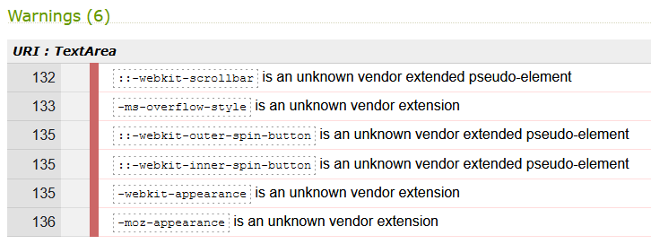 |

I used [JSHint](https://jshint.com) to check the javascript files in my project to make certain it complies with coding standards and that were no syntax errors detected.

+ Found no errors in the following files:

    | _.js File Validation_ | _Screenshot_ |
    |:---------------------:|:------------:|
    | Ratings (```ratings.js```) |  |
    | Country Colour (```countrycolour.js```) |  |
    | Dropdown (```dropdown.js```) |  |
    | Btt Button (```btt-button.js```) |  |
    | New Image Filename (```newimg-filename.js```) |  |

+ Found no errors in Quantity Input (```quantity-input.js```):
    + When validating this code I wanted to know why portions of my code were red despite reporting no errors.
        + I consulted with the Slack community and was told it was a problem with JSHint not understanding the template literal syntax when ES6 is mixed with jQuery.
        + I attempted to find other solutions but due to time constraints and as it throws no errors I have opted to leave it as it is.

            | _quantity-input.js Validation_ |
            |:------------------:|
            |  |

+ Found no errors in Update/Delete (```crate.html``` inline JS - see README.md for more details on this):

    | _Update/Delete Validation_ |
    |:------------------:|
    |  |

+ The following two validations found a single error about undefined variables but after consulting with the Slack community I was told this is because it is defined outside the context of these files and thus these two javascript files passed with no errors.

    + Toasts (```toasts.js```):

        + Found one undefined variable "bootstrap" in ```toasts.js```:

            | _toasts.js Validation_ |
            |:------------------:|
            |  |

    + Stripe (```stripeelements.js```):

        + Found one undefined variable "Stripe" in ```stripeelements.js```:

            | _stripeelements.js Validation_ |
            |:------------------:|
            |  |


I used [PEP8 online](http://pep8online.com/) to test all custom Python code in my project against PEP8 standards.

+ The files that I have tested are listed below:
    + **Checkout App**:
        + ```__init__.py```
        + ```admin.py```
        + ```apps.py```
        + ```forms.py```
        + ```models.py```
        + ```signals.py```
        + ```tests.py```
        + ```urls.py```
        + ```views.py```
        + ```webhook_handler.py```
        + ```webhooks.py```

    + **Crate App**:
        + ```admin.py```
        + ```apps.py```
        + ```contexts.py```
        + ```forms.py```
        + ```models.py```
        + ```tests.py```
        + ```urls.py```
        + ```views.py```
        + ```crate_tools.py```

    + **Home App**:
        + ```admin.py```
        + ```apps.py```
        + ```forms.py```
        + ```models.py```
        + ```tests.py```
        + ```urls.py```
        + ```views.py```
        
    + **Profiles App**:
        + ```admin.py```
        + ```apps.py```
        + ```forms.py```
        + ```models.py```
        + ```tests.py```
        + ```urls.py```
        + ```views.py```
        
    + **Supplies App**:
        + ```admin.py```
        + ```apps.py```
        + ```forms.py```
        + ```models.py```
        + ```tests.py```
        + ```urls.py```
        + ```views.py```
        + ```widgets.py```

    + **Root Directory**:
        + ```custom_storages.py```
        + ```manage.py```

    + **gamer_supplies**:
        + ```asgi.py```
        + ```urls.py```
        + ```wsgi.py```

+ No errors were found within any of these files.

    | _PEP8 Validation_ |
    |:-----------------:|
    ||

**Extra Notes** - I have added these as I am aiming for a distinction and want to cover all the angles.

+ The only files with lines over 79 characters are ```settings.py``` and migration files as when attempting to achieve this it would break the associated sections of my project. As such I have opted to leave them and put a disclaimer here as I am aiming for a distinction performance.

+ Through the development of this project, the Django framework has autogenerated some files within the project of which are untouched. I did not want to delete these files as I was unsure if it would affect the project in any way. As such I have opted to leave them in and put a disclaimer here as I am aiming for a distinction performance.

[Contents](#contents)

### Responsiveness

Responsiveness (website layout)

+ AllAuth templates has been included as a directory as there are a considerable amount of files in it and it would make the table too big.

|              All Pages               | Samsung 9+ | Galaxy S5  | iPhone 6/7/8 | iPhone X | iPad | iPad Pro | Desktop 1024px | Desktop >1200px |
|:------------------------------------:|------------|------------|--------------|----------|------|----------|----------------|-----------------|
|     Website is  responsive >800px    |     N/A    |    N/A     |      N/A     |    N/A   | Good |   Good   |      Good      |       Good      |
|     Website is  responsive <799px    |    Good    |    Good    |     Good     |   Good   |  N/A |    N/A   |       N/A      |       N/A       |
|                                      |            |            |              |          |      |          |                |                 |
| **index.html**                       |            |            |              |          |      |          |                |                 |
| Links/URLs                           |    Good    |    Good    |     Good     |   Good   | Good |   Good   |      Good      |      Good       |
| Images                               |    Good    |    Good    |     Good     |   Good   | Good |   Good   |      Good      |      Good       |
| Renders as expected                  |    Good    |    Good    |     Good     |   Good   | Good |   Good   |      Good      |      Good       |
|                                      |            |            |              |          |      |          |                |                 |
| **supplies.html**                    |            |            |              |          |      |          |                |                 |
| Links/URLs                           |    Good    |    Good    |     Good     |   Good   | Good |   Good   |      Good      |      Good       |
| Images                               |    Good    |    Good    |     Good     |   Good   | Good |   Good   |      Good      |      Good       |
| Renders as expected                  |    Good    |    Good    |     Good     |   Good   | Good |   Good   |      Good      |      Good       |
|                                      |            |            |              |          |      |          |                |                 |
| **crate.html**                       |            |            |              |          |      |          |                |                 |
| Links/URLs                           |    Good    |    Good    |     Good     |   Good   | Good |   Good   |      Good      |      Good       |
| Images                               |    Good    |    Good    |     Good     |   Good   | Good |   Good   |      Good      |      Good       |
| Renders as expected                  |    Good    |    Good    |     Good     |   Good   | Good |   Good   |      Good      |      Good       |
|                                      |            |            |              |          |      |          |                |                 |
| **checkout.html**                    |            |            |              |          |      |          |                |                 |
| Links/URLs                           |    Good    |    Good    |     Good     |   Good   | Good |   Good   |      Good      |      Good       |
| Images                               |    Good    |    Good    |     Good     |   Good   | Good |   Good   |      Good      |      Good       |
| Renders as expected                  |    Good    |    Good    |     Good     |   Good   | Good |   Good   |      Good      |      Good       |
|                                      |            |            |              |          |      |          |                |                 |
| **checkout_success.html**            |            |            |              |          |      |          |                |                 |
| Links/URLs                           |    Good    |    Good    |     Good     |   Good   | Good |   Good   |      Good      |      Good       |
| Images                               |    Good    |    Good    |     Good     |   Good   | Good |   Good   |      Good      |      Good       |
| Renders as expected                  |    Good    |    Good    |     Good     |   Good   | Good |   Good   |      Good      |      Good       |
|                                      |            |            |              |          |      |          |                |                 |
| **profile.html**                     |            |            |              |          |      |          |                |                 |
| Links/URLs                           |    Good    |    Good    |     Good     |   Good   | Good |   Good   |      Good      |      Good       |
| Images                               |    Good    |    Good    |     Good     |   Good   | Good |   Good   |      Good      |      Good       |
| Renders as expected                  |    Good    |    Good    |     Good     |   Good   | Good |   Good   |      Good      |      Good       |
|                                      |            |            |              |          |      |          |                |                 |
| **supply_add.html**                  |            |            |              |          |      |          |                |                 |
| Links/URLs                           |    Good    |    Good    |     Good     |   Good   | Good |   Good   |      Good      |      Good       |
| Images                               |    Good    |    Good    |     Good     |   Good   | Good |   Good   |      Good      |      Good       |
| Renders as expected                  |    Good    |    Good    |     Good     |   Good   | Good |   Good   |      Good      |      Good       |
|                                      |            |            |              |          |      |          |                |                 |
| **supply_edit.html**                 |            |            |              |          |      |          |                |                 |
| Links/URLs                           |    Good    |    Good    |     Good     |   Good   | Good |   Good   |      Good      |      Good       |
| Images                               |    Good    |    Good    |     Good     |   Good   | Good |   Good   |      Good      |      Good       |
| Renders as expected                  |    Good    |    Good    |     Good     |   Good   | Good |   Good   |      Good      |      Good       |
|                                      |            |            |              |          |      |          |                |                 |
| **review_add.html**                  |            |            |              |          |      |          |                |                 |
| Links/URLs                           |    Good    |    Good    |     Good     |   Good   | Good |   Good   |      Good      |      Good       |
| Images                               |    Good    |    Good    |     Good     |   Good   | Good |   Good   |      Good      |      Good       |
| Renders as expected                  |    Good    |    Good    |     Good     |   Good   | Good |   Good   |      Good      |      Good       |
|                                      |            |            |              |          |      |          |                |                 |
| **reviews_manage.html**              |            |            |              |          |      |          |                |                 |
| Links/URLs                           |    Good    |    Good    |     Good     |   Good   | Good |   Good   |      Good      |      Good       |
| Images                               |    Good    |    Good    |     Good     |   Good   | Good |   Good   |      Good      |      Good       |
| Renders as expected                  |    Good    |    Good    |     Good     |   Good   | Good |   Good   |      Good      |      Good       |
|                                      |            |            |              |          |      |          |                |                 |
| **coupons_manage.html**              |            |            |              |          |      |          |                |                 |
| Links/URLs                           |    Good    |    Good    |     Good     |   Good   | Good |   Good   |      Good      |      Good       |
| Images                               |    Good    |    Good    |     Good     |   Good   | Good |   Good   |      Good      |      Good       |
| Renders as expected                  |    Good    |    Good    |     Good     |   Good   | Good |   Good   |      Good      |      Good       |
|                                      |            |            |              |          |      |          |                |                 |
| **All Auth Templates**               |            |            |              |          |      |          |                |                 |
| Links/URLs                           |    Good    |    Good    |     Good     |   Good   | Good |   Good   |      Good      |      Good       |
| Images                               |    Good    |    Good    |     Good     |   Good   | Good |   Good   |      Good      |      Good       |
| Renders as expected                  |    Good    |    Good    |     Good     |   Good   | Good |   Good   |      Good      |      Good       |
|                                      |            |            |              |          |      |          |                |                 |
| **404.html**                         |            |            |              |          |      |          |                |                 |
| Links/URLs                           |    Good    |    Good    |     Good     |   Good   | Good |   Good   |      Good      |      Good       |
| Images                               |    Good    |    Good    |     Good     |   Good   | Good |   Good   |      Good      |      Good       |
|                                      |            |            |              |          |      |          |                |                 |
| **500.html**                         |            |            |              |          |      |          |                |                 |
| Links/URLs                           |    Good    |    Good    |     Good     |   Good   | Good |   Good   |      Good      |      Good       |
| Images                               |    Good    |    Good    |     Good     |   Good   | Good |   Good   |      Good      |      Good       |
|                                      |            |            |              |          |      |          |                |                 |
| **toast_success.html**               |            |            |              |          |      |          |                |                 |
| Links/URLs                           |    Good    |    Good    |     Good     |   Good   | Good |   Good   |      Good      |      Good       |
| Images                               |    Good    |    Good    |     Good     |   Good   | Good |   Good   |      Good      |      Good       |
|                                      |            |            |              |          |      |          |                |                 |
| **toast_error.html**                 |            |            |              |          |      |          |                |                 |
| Links/URLs                           |    Good    |    Good    |     Good     |   Good   | Good |   Good   |      Good      |      Good       |
| Images                               |    Good    |    Good    |     Good     |   Good   | Good |   Good   |      Good      |      Good       |
|                                      |            |            |              |          |      |          |                |                 |
| **toast_info.html**                  |            |            |              |          |      |          |                |                 |
| Links/URLs                           |    Good    |    Good    |     Good     |   Good   | Good |   Good   |      Good      |      Good       |
| Images                               |    Good    |    Good    |     Good     |   Good   | Good |   Good   |      Good      |      Good       |
|                                      |            |            |              |          |      |          |                |                 |
| **custom_clearable_file_input.html** |            |            |              |          |      |          |                |                 |
| Links/URLs                           |    Good    |    Good    |     Good     |   Good   | Good |   Good   |      Good      |      Good       |
| Images                               |    Good    |    Good    |     Good     |   Good   | Good |   Good   |      Good      |      Good       |

Notes:

+ Through the use of Bootstrap and my own design input the site is responsive on all screen sizes that I have tested personally. There may be slight issues on certain abstract displays that might need additional media queries in future releases.

[Contents](#contents)

### Browser Compatibility

I tested the appearance and responsiveness of the website across 6 different browsers and varying browser sizes and these are my results:

|    All Pages   | Firefox | Chrome |  IE  | Edge | Opera | Safari |
|:--------------:|:-------:|:------:|:----:|:----:|:-----:|:------:|
| Appearance     |   Good  |  Good  | Good | Good |  Good |  Good  |
| Responsiveness |   Good  |  Good  | Good | Good |  Good |  Good  |

[Contents](#contents)

### Testing User Stories

#### First Time User

+ As a **First Time User**, I want to easily understand the site upon loading it.
    + I have included an appropriate header and tagline in the home page which informs users what the site is for and how they can use it.

        | _Home Page_ |
        |:-----------:|
        |  |

+ As a **First Time User**, I want to be able to intuitively navigate the entire site with ease.
    + The site features a main navigation bar at the top of the page which contains links to the other site pages.
    + I have included 3 external links to social media pages in the footer that will open the base website for that social media page in a new tab/window.
    + I have also included buttons throughout the site that link to other pages and features within the site.

        | _Navigation Bar_ |
        |:----------------:|
        |  |

+ As a **First Time User**, I want to be able to receive full site functionality on my mobile, tablet and PC.
    + I have used [Bootstrap 5](https://getbootstrap.com/)'s support for responsive design to make the site responsive across multiple devices including mobile, tablet and PC.
    + I have tested the site across multiple devices to ensure content displays as intended, proof can be found [here](#responsiveness).

+ As a **First Time User**, I want to be able to see what supplies are available for purchase on the site.
    + On the home page and navigation bar there is a button "Snack Now" which redirects users to the supplies page.
        + This allows first time users to see what supplies are available to add to a crate before they register for an account to make a crate/purchase.
        + The navigation link can be see in First Time User story 2 and I have included a picture of the button below.

            | _Supplies Page_ |
            |:---------------:|
            |  |

+ As a **First Time User**, I want to know the prices.
    + On the Supply page, for every card that is rendered I have included the price of the Supply. This price is reflected across all parts of the site.
    
        | _Supply Prices_ |
        |:---------------:|
        |  |

+ As a **First Time User**, I want to be able to seamlessly sign up for an account and receive a confirmation email.
    + The navigation bar contains a link to the register page which allows new users to easily initiate the registration process.
    + After submitting the registration form with valid information the user will receive a notification and site content informing them about an email confirmation.
    + The verification email the user receives will contain an email confirm link allowing them to complete the registration process once clicked.
    + Once the email for the account has been confirmed successfully, the user will be signed up for an account.

    + I completed a test registration using an email from [Temp Mail](https://temp-mail.org/en/) to provide relevant screenshots throughout the process.

        | _Register_ | _Screenshot_ |
        |:----------:|:-------:|
        | Register Empty |  |
        | Register Filled |  |
        | Register Verify |  |
        | Register Verify Notification |  |
        | Register Email |  |
        | Register Confirm | 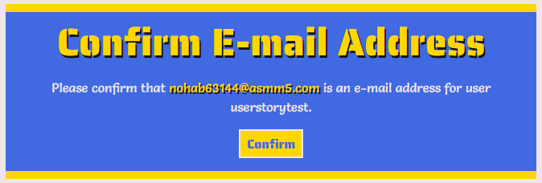 |
        | Register Success |  |

+ As a **First Time User**, I want to read reviews from other users.
    + On the home page I have included a reviews section where users can read reviews left by others displayed in a Bootstrap carousel.

        | _Reviews_ |
        |:---------:|
        | 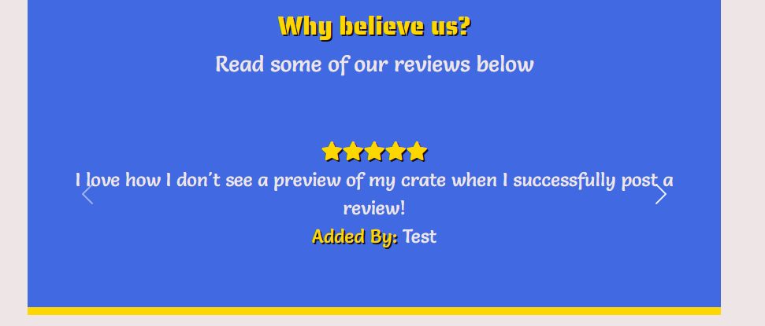 |

+ As a **First Time User**, I want to be able to access the company's associated social media profiles.
    + Inluded in the footer are links to social media platforms which will open in a new tab/window when clicked.
        + These links currently point to the homepage for the associated social media platforms as the brand's socials do not exist at this point in time.

            | _Footer_ |
            |:--------:|
            |  |

+ As a **First Time User**, I want to be able to contact the company with any relevant questions.
    + I have included an email link denoted by an envelope icon in the footer to allow users to contact the site owner with any queries they may have.
    + Proof of this icon can be found in the footer picture on the previous user story.

[Contents](#contents)

#### Registered User

+ As a **Registered User**, I want to be able to easily login and logout of my account.
    + I have included a link in the navigation bar to the login page and when logged in this will see a logout link.

        | _Login/Logout_ |
        |:--------------:|
        |  |
        |  |

+ As a **Registered User**, I want to be able to easily add, update and delete items from my supply crate.
    + I have added an Add To Crate button on each supply in ```supplies.html``` which allows the user to easily add a selected quantity of the supply to their crate.
    + I have added Update/Delete buttons for each crate item in ```crate.html``` which allows the user to easily update/delete supplies in their crate.

        | _Add To Crate_ | _Update/Delete_ |
        |:--------------:|:---------------:|
        |  |  |

    + I have simulated creating a crate for use through testing.

        | _Adding to Crate_ | _Info_ | _Image_ |
        |:--:|:------:|:-------:|
        | Adding Item 1 | Adding 5 Banana Yazoo to crate. |  |
        | Adding Item 2 | Adding 3 McVities Iced Gems 6 pack to crate. |  |
        | Adding Item 3 | Added Apple Slices to crate. |  |
        | Add Success Notification | Notification displayed with a preview of their current crate. |  |
        | Update Filled | Filling out update quantity form with 5. |  |
        | Update Success | Upon clicking update the quantity updates. |  |
        | Update Success Notification | Notification displayed that the quantity of that supply has been updated. |  |
        | Delete Success Notification | When clicking the delete button the selected supply is removed from the crate. |  |
        | Delete Success | When viewing ```crate.html``` you can see Apple Slices have been removed from the crate. |  |

+ As a **Registered User**, I want to be able to easily purchase my crate.
    + Whenever the crate is updated the user is given a message containing a link to ```crate.html```.
    + I have created a crate in the previous story which I will use to display ```crate.html``` and the checkout process.
    + I completed a test checkout using the account made during the registration testing using the temp email from [Temp Mail](https://temp-mail.org/en/).
    + This was to provide relevant screenshots throughout the process simulating a first time user becoming a registered user and checking out.
    
        | _Checkout_ | _Info_ | _Screenshot_ |
        |:----------:|:------:|:-------:|
        | Viewing Crate | Crate displays as intended on ```crate.html``` (same picture from previous user story to remove redundant files). |  |
        | Applying Coupon | Entering a invalid coupon displays an error to the user. |  |
        | Applying Coupon | Entering a valid coupon applies the discount and is displayed to the user. |  |
        | Checkout Button | ```crate.html``` contains a "Secure Checkout" button which redirects users to ```checkout.html```. |  |
        | Checkout Empty | On ```checkout.html``` the user can see a preview of their crate with a form containing placeholders to fill out their delivery and payment information. |  |
        | Intent Created | Stripe payment intent created successfully. |  |
        | Checkout Filled | Filled checkout form with ```save-info``` checked. |  |
        | Payment Processing | Upon clicking "Complete Order" the form and buttons are disabled and a loading overlay is shown to inform the user of what is happening. |  |
        | Payment Authentication | ADMIN: I included this to test errors when checking out |  |
        | Payment Failed | When a payment fails the user is informed gracefully with their form intact. | 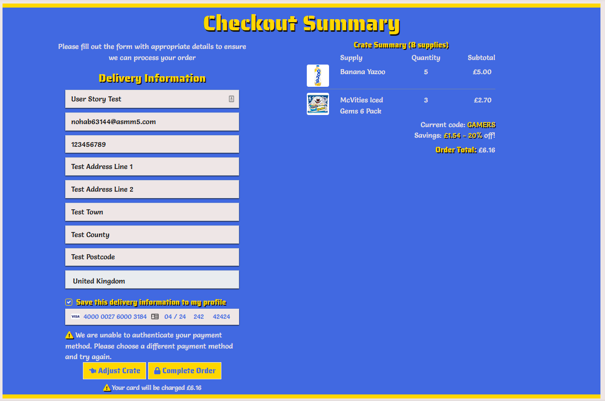 |
        | Checkout Success | When a payment succeeds the user is redirected to ```checkout_success.html``` with details of their purchase and a notification informing them of a checkout confirmation email. |  |
        | Intent/Charge Succeeded | Stripe ```payment_intent.succeeded``` and ```charge.succeeded``` have both succeeded as shown here. I have included all the events sent to the webhook for authentication to provide real-time proof of this process functioning as intended. |  |
        | Charge Amount | Stripe ```charge.succeeded``` displays the correct amount. |  |
        | Payment Intent Succeeded Amount | Stripe ```payment_intent.succeeded``` displays the correct amount. |  |
        | Checkout Admin | The completed order is created successfully in the admin panel under "Orders". |  |
        | Checkout Admin Details | The order details are stored correctly. |  |
        | Checkout Admin Items | The order contains the correct items purchased. |  |

+ As a **Registered User**, I want to receive a purchase confirmation email.
    + This process is using the same information for real time proof through my testing.
    + After a successful checkout, the user will be directed to ```checkout_success.html``` which will display all their order details and will receive an email confirming it with a link to view the full order details.

        | _Email Confirmation_ |
        |:--------------------:|
        |  |

+ As a **Registered User**, I want to be able to view my previous orders.
    + I have used the same account to provide proof the user's new order displays on their profile with their updated delivery information. 

        | _Order History_ | _Info_ | _Screenshot_ |
        |:---------------:|:------:|:-------:|
        | Profile Order | Included in ```profile.html``` is a section which displays the user's previous orders and the items in them. |  |
        | Order History | When clicking an order number in ```profile.html``` they are redirected to a modified version of ```checkout_success.html``` which displays a rundown of all information associated with the order including if a coupon was applied. |  |
        | Past Order Notification | The user is informed that it is simply a record of their previous purchase and not a new purchase. |  |

+ As a **Registered User**, I want to be able to easily update my contact and delivery information.
    + Included in the checkout form is a checkbox which allows users to save the checkout delivery information to their profile for quicker future checkouts.
    + If the option is chosen, their delivery address will be saved to their profile which can be updated on ```profile.html``` at anytime.
    + I have used the same account to provide proof the user's new order displays on their profile with their updated delivery information. 

        | _Order History_ | _Info_ | _Screenshot_ |
        |:---------------:|:------:|:-------:|
        | Information Prefilled | The form on ```profile.html``` is prefilled from the previous checkout. |  |
        | Information Filled | The form filled out with updated information. |  |
        | Information Success | Upon submitting the form the user will be notified of their information being updated successfully and kept on ```profile.html``` |  |
        | New Information | When creating a crate and navigating to ```checkout.html``` again the new information is displayed. |  |

+ As a **Registered User**, I want to be able to add a review about my experience on the site.
    + Included in the homepage is an "Add Review" button which is displayed underneath the current reviews carousel.

        | _Adding a Review_ | _Info_ | _Screenshot_ |
        |:-----------------:|:------:|:------------:|
        | Empty Review Form | Upon clicking the "Add Review" button, the user will be directed to ```review_add.html``` which contains a form that allows the user to add a review to the site. |  |
        | Add Review | Entering a review and choosing a rating. | 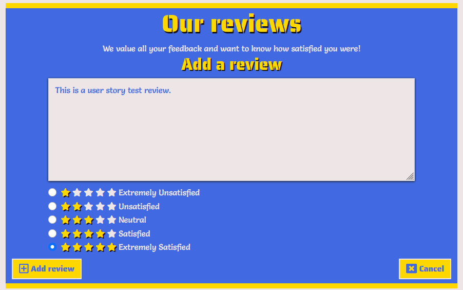 |
        | Add Review Success |  Upon submitting valid information in the Add Review form (provided in the placeholder and choosing a rating) the review will be added to the data store and displayed on ```index.html``` as well as the delete review button (this functionality is covered in the admin section as admins have permission to delete any review). | 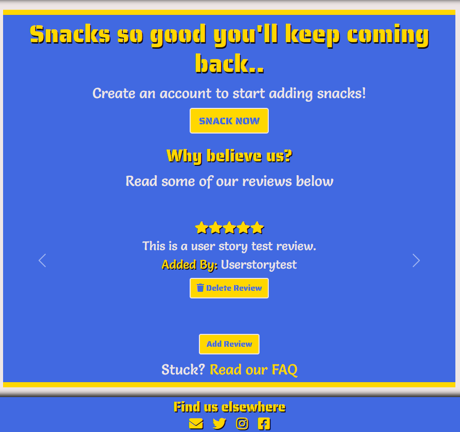 |

    + Upon clicking the cancel button the data will be untouched, the form will close and the user returned to the home page.

[Contents](#contents)

#### Site Owner or Superuser

+ As a **Site Owner/Superuser**, I want to be able to add new supplies.
    + I have included an 'Add Supply' button on ```supplies.html``` and in the navigation bar which is only accessible by a superuser.

        | _Add Supply Button_ |
        |:-------------------:|
        |  |

        + A supply image is not required and for testing purposes. I have included this to display how it handles having no image.

            | _Adding a Supply_ | _Info_ | _Screenshot_ |
            |:-----------------:|:------:|:------------:|
            | Empty Add Supply form | Upon clicking this button the superuser will be redirected to ```supply_add.html``` containing an empty Add Supply form. | 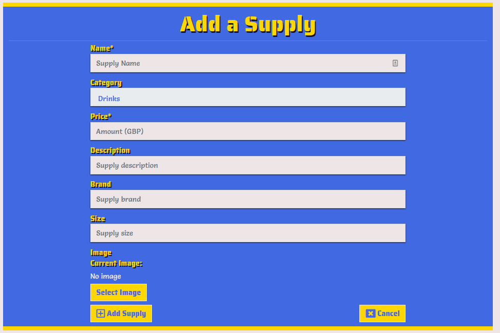 |
            | Add Supply | Add Supply form contains placeholders in each field to provide context. I have filled out test information in this screenshot. |  |
            | Add Supply Success | Upon submitting valid information in the Add Supply form (provided in the placeholder for each field) the supply will be added to the data store and displayed in the list on ```supplies.html``` |  |

    + Upon clicking the cancel button the data will be untouched, the form will close and the user returned to the supplies page.

+ As a **Site Owner/Superuser**, I want to be able to edit and delete supplies.
    + Included in ```supplies.html``` within each supply card I have added edit and delete buttons (denoted by relevant icons) under the 'Add to Crate' button which is only accessible by a superuser.

        | _Edit/Delete Supply Buttons_ |
        |:----------------------------:|
        |  |

    + I have the used the Supply created in the previous test to provide real time proof of my testing.
    + Upon clicking the edit button the superuser will be redirected to the Edit Supply form shown below.

        | _Edit a Supply_ | _Info_ | _Screenshot_ |
        |:---------------:|:------:|:------------:|
        | Prefilled Edit Supply form | Once on the ```supply_edit.html``` the information of the associated supply is prefilled in the form. |  |
        | Edit Supply | In addition to altering the information, I have added an image to display how it handles adding images (each field also contains a placeholder if the user removes the prefilled information). | 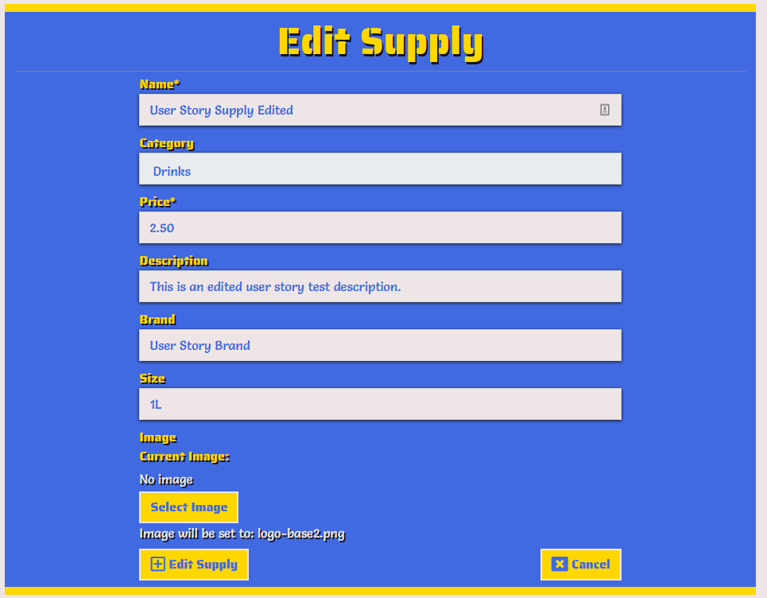 |
        | Edit Supply Success | Upon submitting valid information in the Edit Supply form the supply will be edited in the data store and displayed in the list accordingly. |  |

        + Upon clicking the cancel button the data will be untouched, the form will close and the user returned to the supplies page.


    + Upon clicking the delete button the user will see a delete confirmation modal as shown below.

        | _Delete Supply_ |
        |:--------------:|
        |  |

        + Upon clicking the delete button in the modal the supply will be deleted from the data store and is now not shown in the list.

            | _Delete Supply Success_ |
            |:--------------:|
            | 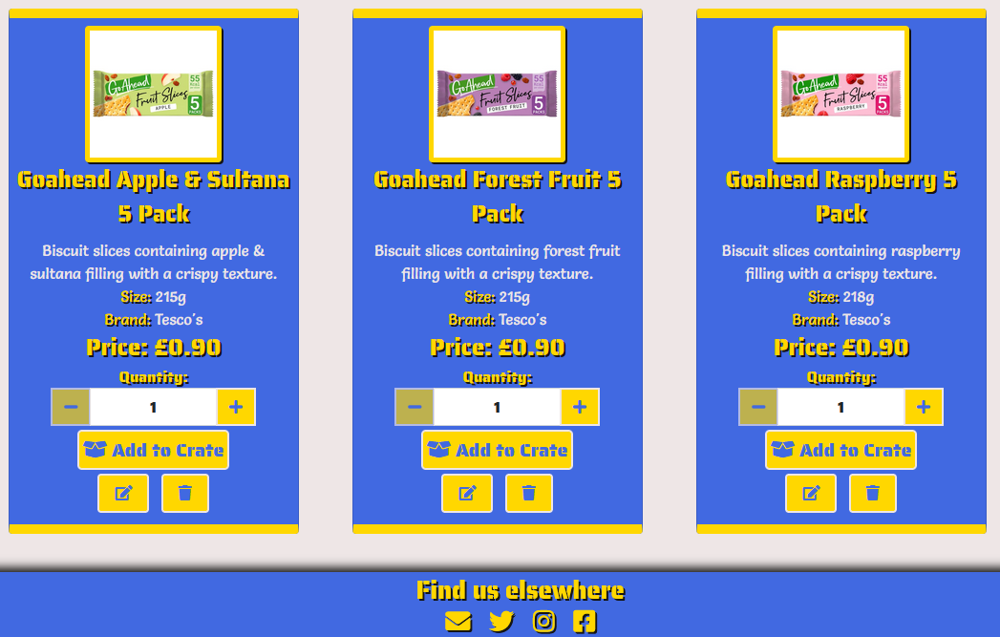 |

        + Upon clicking the cancel button the data will be untouched and the modal will close.

+ As a **Site Owner/Superuser**, I want to be able to manage and delete reviews.
    + I have included ```reviews_manage.html``` which allows a superuser to view all current reviews posted to the site and an option to delete them as necessary.

        | _Manage Reviews Page_ |
        |:---------------------:|
        |  |

    + This delete button also appears under each review in ```index.html``` for superusers and the person who added the review.
    + Upon clicking the delete button the user will see a delete confirmation modal as shown below.

        | _Delete Review_ |
        |:--------------:|
        |  |

        + Upon clicking the delete button in the modal the review will be deleted from the data store and is now not shown in the list.

            | _Delete Review Success_ |
            |:--------------:|
            |  |

        + Upon clicking the cancel button the data will be untouched and the modal will close.

        + **Security**: Throughout the implementation of allowing regular users to delete their reviews I identified a security risk.
            + I have outlined my process of discovering this issue:
                + Regular user adds a review so the delete review button appears as this is the only way to call the function.
                + Regular user inspects the button in dev tools and changes the value to a different review ID.
                + It was allowing the user to delete the review and to fix this issue I have included a fallback after checking if the user is not a superuser.
                    + I have implemented the following code:

                        ```python
                        messages.error(request, 'Only the review posters have \
                        permission to delete reviews.')
                        return redirect(reverse('home'))

                + When testing the above method again I received the error message above and the review remained intact.

+ As a **Site Owner/Superuser**, I want to be able to view and manage all coupon codes.
    + I have included a page (```coupons_manage.html```) for superusers to manage all the existing coupon codes and the option to add new ones.

        | _Manage Coupons Page_ |
        |:---------------------:|
        | 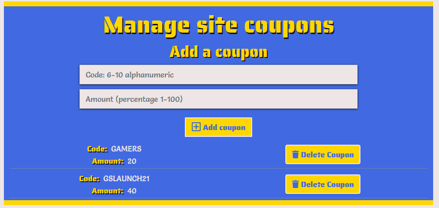 |

    + Upon submitting valid information in the Add Coupon form (provided in the placeholder for each field) the coupon will be added to the data store and displayed in the list.

        | _Adding a Coupon_ |_Screenshot_|
        |:-----------------:|:----------:|
        | Empty Coupon form |  |
        | Add Coupon |  |
        | Add Coupon Success |  |

    + Upon clicking the delete button the user will see a delete confirmation modal as shown below.

        | _Delete Coupon_ |
        |:--------------:|
        |  |

        + Upon clicking the delete button in the modal the coupon will be deleted from the data store and is now not shown in the list.

            | _Delete Coupon Success_ |
            |:--------------:|
            | 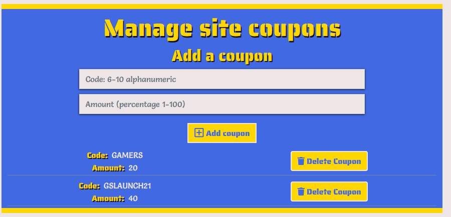 |

        + Upon clicking the cancel button the data will be untouched and the modal will close.

+ As a **Site Owner/Superuser**, I want to be able to access the admin section of the site to view orders made, the items they contain and the delivery information.
    + Included in the main navigation bar is a dropdown that contains the admin features of the site.
    + This includes a link to Add Supply, Manage Reviews, Manage Coupons and the Django admin panel which is only viewable by superusers.

        | _Admin Nav Link_ |
        |:---------------------:|
        |  |

[Contents](#contents)

### Additional Testing

**General Testing**:
+ All navigation buttons (including navbar and mobile links) redirect the user to the correct page in the site.
+ All buttons produce the desired effect when clicked.
+ External links open in a new tab/window and link to the correct site.
+ Images load properly.

**Site content Testing**:
+ **Users who are not logged in**:
    + Are able to:
        + Register an account provided the username is not already taken.
        + View the Home, Supplies, Register and Login pages.
    + Are not able to:
        + Add, Edit or Delete items from their crate.
        + Visit checkout, checkout success/order history or profile page.

+ **Regular Users who are logged in**:
    + Are able to:
        + View Home, Supplies, Crate, Checkout, Checkout Success/Order history and profile pages.
        + View the home page with an option to add a review or delete a previously added review.
        + View the supplies page with options to add/update quantity items in their crate.
        + View the crate page with options to add/update/delete items in their crate.
        + View the checkout page to purchase their crate.
        + View the checkout success/order history page based on whether they have come from a successful checkout or their profile.
        + View their order history and default delivery address in their profile page.
        + Logout of their account.
    + Are not able to:
        + Access edit or delete supply buttons on the supplies page.
        + Access Login, Register, Add/Edit Supply, Manage Reviews or Admin pages.

+ **Admin users who are logged in**:
    + Admin users will receive identical functionality to the regular users with a few small changes.
    + Admins are able to:
        + Access the django admin panel.
        + View and use the Manage Reviews button on the homepage.
        + Access manage reviews page and able to delete reviews.
        + Access manage coupons page and able to add and delete coupons.
        + Access add, edit or delete supply buttons on the supplies page.
        + Access Add Supply page from main navigation bar.

+ **Toasts display when**:
    + A user registers, confirms their email and logs in/out of their account.
    + A user adds a supply to their crate.
    + A user successfully orders their crate.
    + A user successfully adds a review.
    + A user applies a coupon (success and error).
    + A user deletes a review they have posted.
    + A registered user tries to access or use an admin only feature.
    + An admin adds/edits/deletes a supply.
    + An admin adds or deletes a review.
    + An admin adds or deletes a coupon.

+ **Stripe testing**:
    + Stripe payments were tested by sending test webhooks from the Stripe dashboard through the development of this project.

        | _Stripe Test Webhook_ |
        |:---------------------:|
        |  |

+ **Validation**:
    + Validation works throughout the site to prevent junk input from being entered in the following forms:

    + ```supplies.html``` and ```crate.html```:

        | _Adjust Quantity_ | _Image_ |
        |:-----------------:|:-------:|
        | Blank |  |
        | Less than 1 |  |
        | More than 99 |  |
        | Non Numerical |  |

    + ```supply_add.html``` and ```supply_edit.html```:

        | _Add/Edit Supply_ | _Image_ |
        |:-----------------:|:-------:|
        | Supply Name Blank |  |
        | Price Blank |  |
        | Price non numerical |  |

    + Add Review (```review_add.html```):
        
        | _Add Review_ | _Image_ |
        |:------------:|:-------:|
        | Review Blank |  |
        | Review Under 10 Characters | 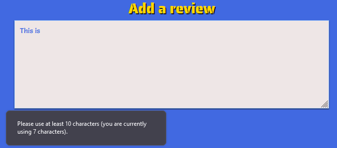 |
        | Rating Blank |  |

    + Coupon Manage (```coupons_manage.html```)

        | _Add Coupon_ | _Image_ |
        |:------------:|:-------:|
        | Empty Coupon Form with validation shown as placeholders |  |
        | Coupon Code under 6 characters |  |
        | Coupon Amount not numerical |  |
        | Correct Information |  |
        | Coupon Displayed |  |
    
    + Apply Coupon (```crate.html```):

        | _Apply Coupon_ | _Image_ |
        |:--------------:|:-------:|
        | Code Blank |  |
        | Invalid Code |  |
        | Valid Code |  |

    + Order Form (```checkout.html```):

        | _Order Form_ | _Image_ |
        |:------------:|:-------:|
        | Blank Full Name |  |
        | Blank Contact Number |  |
        | Contact Number Under 5 Digits |  |
        | Blank Address Line 1 |  |
        | Blank Address Line 2 |  |
        | Blank Town |  |
        | Blank Card Information |  |

        + Notes: 
            + Contact Number is not required in the model (see [partially resolved](#partially-resolved) in the bugs section).
            + The card input field validation outside of blank inputs is handled by Stripe and thus not included in this testing section.

[Contents](#contents)

### Bugs
+ **Review Carousel**:
    + Upon adding this feature it worked when there was one review in the list. When adding another review, the two reviews were displaying simultaneously as Bootstrap uses the ```active``` class to determine what to show.
    + After researching around I found [this post](https://stackoverflow.com/questions/35836879/how-to-use-for-loop-with-bootstrap-carousel) which utilized a for loop inside the inner carousel to only render active for the first iteration in the loop.
        + The code stated was ```active``` which I adapted to check for the first review.

+ **Carousel auto scrolling**:
    + When adding in the carousel it was auto scrolling which I wanted to remove according to the assessment handbook about aggressive autoplaying of content.
        + I consulted the Bootstrap docs and when reading about the interval feature I noticed in the below article [here](https://getbootstrap.com/docs/5.0/components/carousel/#disable-touch-swiping) that you can set ```data-bs-interval="false"``` to prevent the carousel from autoplaying.

+ **manage_crate**:
    + I implemented use of a session variable ```manage_crate``` which only sets to True when a user adds or edits their crate contents on the supplies page and displays a summary of their crate in the notification.
        + This was working as intended but when being a user who had not initiated the variable it was throwing a variety of errors trying to load ```supplies.html```.
        + My original troubleshooting was at the start of the ```all_supplies``` view; setting a variable ```manage_crate``` to ```None```. This did not solve the problem.
    + I began researching for how to check for the existence of a session variable and found [this post](https://stackoverflow.com/questions/10492819/checking-if-session-variable-is-set-or-not-in-django/10492856) which utilized the get method to make the code cleaner as no ```if/else``` statement was used.
        + The code displayed was:

            ```orderId = request.session.get('orderId',ts)```

            ```request.session['orderId']=ts```

        + I adapted this to check if ```manage_crate``` existed in the session variables.
            + If it does exist, store the data in the view.
            + If it does not exist, set it to its current value (which is currently ```None```).

            ```manage_crate = request.session.get('manage_crate', manage_crate)```
            
            ```request.session['manage_crate'] = False```
        + The session variable is then set to ```False``` by default so that the crate summary only shows up in the intended notifications.

+ **Updating totals on orderd with coupons applied**:
    + I implemented a custom model for Coupons in the site and when calculating the order total I was using the following code:

        ```python
            def update_total(self):
        # Update total each time a crate item is added
        self.order_total = (
            self.crateitems.aggregate(
                Sum("crateitem_total"))["crateitem_total__sum"] or 0
        )
        # Checking whether a coupon was applied to the order
        if self.coupon is not None:
            savings = self.crateitems.aggregate(Sum("crateitem_total"))[
                "crateitem_total__sum"
            ] * (self.coupon.amount / Decimal("100"))
            self.order_total = self.order_total - savings

        self.save()

    + After some troubleshooting and receiving errors about decimals I figured the problem had to lie within the ```if self.coupon is not None``` block and aggregating the crate items to 0 worked without issue on orders not including a coupon.

    + After some testing I realized I did not need to call the aggregate function again as ```self.order_total``` had already been calculated to account for this issue.
        + Updating my function removed the bug and now produces the desired effect and as such I have included my updated code here:

        ```python
        if self.coupon is not None:
            savings = self.order_total * (self.coupon.amount / Decimal("100"))
            self.order_total = self.order_total - savings

[Contents](#contents)

### UNRESOLVED

#### Partially Resolved

+ **Checking out without a contact number**:

    + When implementing the checkout process I followed with Boutique Ado to set up my Stripe webhooks (as mentioned in [README.md](README.md)).
    + On my ```Order``` model I have the Contact Number field as not required (```null=True, blank=True```).
    + When attempting to checkout without using a contact number Stripe throws an error shown in the below screenshot.

        | _Payment Intent Bug_ |
        |:--------------------:|
        |  |

    + I came up with a few ideas on how to solve this bug:
        + **Option 1**: Modify the Order model to require contact number.
            + While this would solve the problem I felt if this was a real world application, the decision to make model changes would not be mine to make and thus have not chosen this option.
        + **Option 2**: Modify the payment intent to check if a contact number has been entered and if not return an empty field for billing details.
            + As mentioned previously in the README.md credits the full stack frameworks [Boutique Ado](https://github.com/Code-Institute-Solutions/boutique_ado_v1) walkthrough project provided the base for this functionality as I am very inexperienced with it.
            + Despite this I wanted to try and fix it so I investigated throughout the Stripe documentation [here](https://stripe.com/docs). I then tested this in my sample project made throughout the course to see if I could fix this issue without affecting my milestone project.
            + I was unable to generate any successful payments and thus have not chosen this option.
        + **Option 3**: Add validation to ```forms.py``` in the checkout app to prevent a contact number being entered blank.
            + This option is a fallback to the other two as I did not want to leave my project in a state where the user could produce this error whilst checking out.
            + I validated the ```contact_number``` field within ```forms.py``` using the following code:
                
                ```python
                if field == 'contact_number':
                    self.fields[field].widget.attrs['pattern'] = '^[0-9]{5,}$'
                    self.fields[field].widget.attrs['required'] = ''
            + This means that the input has to be numbers only and a minimum of 5 digits as per my research [here](https://stackoverflow.com/questions/14894899/what-is-the-minimum-length-of-a-valid-international-phone-number).

    + Out of the three options I have outlined above I felt option 3 was the safest but given more time and experience with Stripe functionality I would go for option 2.
    + This leaves this bug as partially resolved.

#### Completely Unresolved

+ **Date Format on Order History notification**:
    + While this may not be considered a bug or major I felt it best to include here as a disclaimer for content not being consistent between order history and the notification.
    + When displaying the date on the order history page it would display as intended:

        | _Order History Date_ |
        |:--------------------:|
        |  |

    + However in the notification the date would display unformatted:

        | _Previous Order Notification Date_ |
        |:--------------------:|
        |  |

    + In trying to resolve this I found [this post](https://stackoverflow.com/questions/7737146/how-can-i-change-the-default-django-date-template-format) which involved changing the date format within ```settings.py``` and I opted not to do this due to inexperience with Django settings, time constraints and it being a minor bug.

+ **Save Info checkbox**:
    + I would consider this to be a major bug and I have outlined my process of attempting to fix it as well as providing a disclaimer for this as per the distinction performance.
    + This feature was implemented on the checkout page to allow users to have their delivery information saved to their profile.
    + It functioned as intended when trying to save the information; yet if the box is unchecked the information would still save.
        + I investigated for a potential fix and found a thread in the Code Institute Slack community of someone who experienced a similar issue.
        + They managed to resolve it with tutor support and posted this message regarding this line of code:

            ```<script defer src=""></script>```

            ```
            Moving the link to the stripe_elements.js file
            into the head (extra_js block rather than postload_js) and adding the defer tag fixed the bug for me.  Default delivery information only gets saved/updated if the checkbox is ticked now in both my GitPod and Heroku environments.
            
            I thought I would share here in case it is useful to anyone in future since the posts above definitely helped me!
    + I have tried applying this fix and numerous others which I have found through my investigative process.
        + Everything I have found leads me to believe it is caused somewhere in the webhook handler.
        + As mentioned above and in the README.md credits the full stack frameworks [Boutique Ado](https://github.com/Code-Institute-Solutions/boutique_ado_v1) walkthrough project provided the base for this functionality as I am very inexperienced with it.
        + Due to insufficient experience with Stripe I have opted to leave this bug as unresolved and to state it here in my testing.

[Contents](#contents)