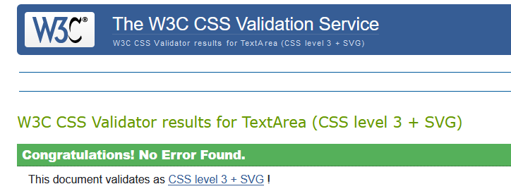
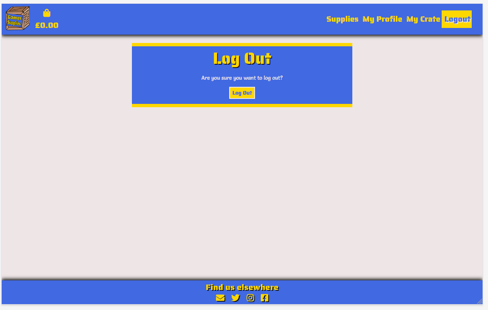
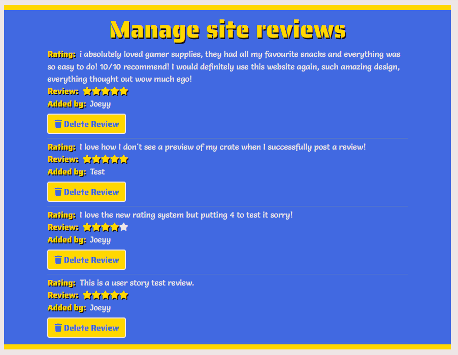

## Testing

I used [w3.org's validator](https://validator.w3.org) for my HTML validation checks.

+ No errors were found within any page:

    | _HTML5 Validation_ |
    |:------------------:|
    |  |

I used [w3.org's validator](https://jigsaw.w3.org/css-validator/) for my CSS validation checks.

+ No errors were found within "base.css" and "checkout.css".

    | _CSS Validation_ |
    |:----------------:|
    |  |

+ ```base.css``` received 6 warnings about properties being an unknown vendor extension and unknown vendor extended pseudo-element.
    + I have chosen to ignore these warnings as these css rules come directly from [w3 Schools](https://www.w3schools.com/howto/)'s how to section regarding hiding scrollbars and arrows on number input fields across all browsers.
    + I have also consulted with the [Code Institute](https://codeinstitute.net/) Slack community regarding this and was told to leave them and mention in my documents somehwere and as such I have included this disclaimer here and a picture detailing the warnings.

        | _CSS Warning_ |
        |:----------------:|
        |  |

I used [JSHint](https://jshint.com) to check the javascript files in my project to make certain it complies with coding standards and that were no syntax errors detected.

+ Ratings (ratings.js):

    | _ratings.js Validation_ |
    |:------------------:|
    |  |

+ Toasts (toasts.js):

    | _toasts.js Validation_ |
    |:------------------:|
    |  |


I used [PEP8 online](http://pep8online.com/) to test all custom Python code against PEP8 standards.

+ No errors were found within the document.

    | _PEP8 Validation_ |
    |:-----------------:|
    ||

**Extra Notes** - I've added these as I am aiming for a distinction and want to cover all the angles.

+ The only files with lines over 79 characters are ```settings.py``` and migration files as when attempting to achieve this it would break the associated sections of my project. As such I have opted to leave them and put a disclaimer here as I am aiming for a distinction performance.

+ Through the development of this project, the Django framework has autogenerated some files within the project of which are untouched. I did not want to delete these files as I was unsure if it would affect the project in any way. As such I have opted to leave them in and put a disclaimer here as I am aiming for a distinction performance.

### Responsiveness

Responsiveness (website layout)

|              All Pages               | Samsung 9+ | Galaxy S5  | iPhone 6/7/8 | iPhone X | iPad | iPad Pro | Desktop 1024px | Desktop >1200px |
|:------------------------------------:|------------|------------|--------------|----------|------|----------|----------------|-----------------|
|     Website is  responsive >800px    |     N/A    |    N/A     |      N/A     |    N/A   | Good |   Good   |      Good      |       Good      |
|     Website is  responsive <799px    |    Good    |    Good    |     Good     |   Good   |  N/A |    N/A   |       N/A      |       N/A       |
|                                      |            |            |              |          |      |          |                |                 |
| **index.html**                       |            |            |              |          |      |          |                |                 |
| Links/URLs                           |    Good    |    Good    |     Good     |   Good   | Good |   Good   |      Good      |      Good       |
| Images                               |    Good    |    Good    |     Good     |   Good   | Good |   Good   |      Good      |      Good       |
| Renders as expected                  |    Good    |    Good    |     Good     |   Good   | Good |   Good   |      Good      |      Good       |
|                                      |            |            |              |          |      |          |                |                 |
| **supplies.html**                    |            |            |              |          |      |          |                |                 |
| Links/URLs                           |    Good    |    Good    |     Good     |   Good   | Good |   Good   |      Good      |      Good       |
| Images                               |    Good    |    Good    |     Good     |   Good   | Good |   Good   |      Good      |      Good       |
| Renders as expected                  |    Good    |    Good    |     Good     |   Good   | Good |   Good   |      Good      |      Good       |
|                                      |            |            |              |          |      |          |                |                 |
| **crate.html**                       |            |            |              |          |      |          |                |                 |
| Links/URLs                           |    Good    |    Good    |     Good     |   Good   | Good |   Good   |      Good      |      Good       |
| Images                               |    Good    |    Good    |     Good     |   Good   | Good |   Good   |      Good      |      Good       |
| Renders as expected                  |    Good    |    Good    |     Good     |   Good   | Good |   Good   |      Good      |      Good       |
|                                      |            |            |              |          |      |          |                |                 |
| **checkout.html**                    |            |            |              |          |      |          |                |                 |
| Links/URLs                           |    Good    |    Good    |     Good     |   Good   | Good |   Good   |      Good      |      Good       |
| Images                               |    Good    |    Good    |     Good     |   Good   | Good |   Good   |      Good      |      Good       |
| Renders as expected                  |    Good    |    Good    |     Good     |   Good   | Good |   Good   |      Good      |      Good       |
|                                      |            |            |              |          |      |          |                |                 |
| **checkout_success.html**            |            |            |              |          |      |          |                |                 |
| Links/URLs                           |    Good    |    Good    |     Good     |   Good   | Good |   Good   |      Good      |      Good       |
| Images                               |    Good    |    Good    |     Good     |   Good   | Good |   Good   |      Good      |      Good       |
| Renders as expected                  |    Good    |    Good    |     Good     |   Good   | Good |   Good   |      Good      |      Good       |
|                                      |            |            |              |          |      |          |                |                 |
| **profile.html**                     |            |            |              |          |      |          |                |                 |
| Links/URLs                           |    Good    |    Good    |     Good     |   Good   | Good |   Good   |      Good      |      Good       |
| Images                               |    Good    |    Good    |     Good     |   Good   | Good |   Good   |      Good      |      Good       |
| Renders as expected                  |    Good    |    Good    |     Good     |   Good   | Good |   Good   |      Good      |      Good       |
|                                      |            |            |              |          |      |          |                |                 |
| **supply_add.html**                  |            |            |              |          |      |          |                |                 |
| Links/URLs                           |    Good    |    Good    |     Good     |   Good   | Good |   Good   |      Good      |      Good       |
| Images                               |    Good    |    Good    |     Good     |   Good   | Good |   Good   |      Good      |      Good       |
| Renders as expected                  |    Good    |    Good    |     Good     |   Good   | Good |   Good   |      Good      |      Good       |
|                                      |            |            |              |          |      |          |                |                 |
| **supply_edit.html**                 |            |            |              |          |      |          |                |                 |
| Links/URLs                           |    Good    |    Good    |     Good     |   Good   | Good |   Good   |      Good      |      Good       |
| Images                               |    Good    |    Good    |     Good     |   Good   | Good |   Good   |      Good      |      Good       |
| Renders as expected                  |    Good    |    Good    |     Good     |   Good   | Good |   Good   |      Good      |      Good       |
|                                      |            |            |              |          |      |          |                |                 |
| **review_add.html**                  |            |            |              |          |      |          |                |                 |
| Links/URLs                           |    Good    |    Good    |     Good     |   Good   | Good |   Good   |      Good      |      Good       |
| Images                               |    Good    |    Good    |     Good     |   Good   | Good |   Good   |      Good      |      Good       |
| Renders as expected                  |    Good    |    Good    |     Good     |   Good   | Good |   Good   |      Good      |      Good       |
|                                      |            |            |              |          |      |          |                |                 |
| **reviews_manage.html**              |            |            |              |          |      |          |                |                 |
| Links/URLs                           |    Good    |    Good    |     Good     |   Good   | Good |   Good   |      Good      |      Good       |
| Images                               |    Good    |    Good    |     Good     |   Good   | Good |   Good   |      Good      |      Good       |
| Renders as expected                  |    Good    |    Good    |     Good     |   Good   | Good |   Good   |      Good      |      Good       |
|                                      |            |            |              |          |      |          |                |                 |
| **All Auth Templates**               |            |            |              |          |      |          |                |                 |
| Links/URLs                           |    Good    |    Good    |     Good     |   Good   | Good |   Good   |      Good      |      Good       |
| Images                               |    Good    |    Good    |     Good     |   Good   | Good |   Good   |      Good      |      Good       |
| Renders as expected                  |    Good    |    Good    |     Good     |   Good   | Good |   Good   |      Good      |      Good       |
|                                      |            |            |              |          |      |          |                |                 |
| **404.html**                         |            |            |              |          |      |          |                |                 |
| Links/URLs                           |    Good    |    Good    |     Good     |   Good   | Good |   Good   |      Good      |      Good       |
| Images                               |    Good    |    Good    |     Good     |   Good   | Good |   Good   |      Good      |      Good       |
|                                      |            |            |              |          |      |          |                |                 |
| **500.html**                         |            |            |              |          |      |          |                |                 |
| Links/URLs                           |    Good    |    Good    |     Good     |   Good   | Good |   Good   |      Good      |      Good       |
| Images                               |    Good    |    Good    |     Good     |   Good   | Good |   Good   |      Good      |      Good       |
|                                      |            |            |              |          |      |          |                |                 |
| **toast_success.html**               |            |            |              |          |      |          |                |                 |
| Links/URLs                           |    Good    |    Good    |     Good     |   Good   | Good |   Good   |      Good      |      Good       |
| Images                               |    Good    |    Good    |     Good     |   Good   | Good |   Good   |      Good      |      Good       |
|                                      |            |            |              |          |      |          |                |                 |
| **toast_error.html**                 |            |            |              |          |      |          |                |                 |
| Links/URLs                           |    Good    |    Good    |     Good     |   Good   | Good |   Good   |      Good      |      Good       |
| Images                               |    Good    |    Good    |     Good     |   Good   | Good |   Good   |      Good      |      Good       |
|                                      |            |            |              |          |      |          |                |                 |
| **toast_info.html**                  |            |            |              |          |      |          |                |                 |
| Links/URLs                           |    Good    |    Good    |     Good     |   Good   | Good |   Good   |      Good      |      Good       |
| Images                               |    Good    |    Good    |     Good     |   Good   | Good |   Good   |      Good      |      Good       |
|                                      |            |            |              |          |      |          |                |                 |
| **custom_clearable_file_input.html** |            |            |              |          |      |          |                |                 |
| Links/URLs                           |    Good    |    Good    |     Good     |   Good   | Good |   Good   |      Good      |      Good       |
| Images                               |    Good    |    Good    |     Good     |   Good   | Good |   Good   |      Good      |      Good       |

Notes:

+ Through the use of Bootstrap and my own design input the site is responsive on all screen sizes that I have tested personally. There may be slight issues on certain abstract displays that might need additional media queries in future releases.

### Browser Compatibility

I tested the appearance and responsiveness of the website across 6 different browsers and varying browser sizes and these are my results:

|    All Pages   | Firefox | Chrome |  IE  | Edge | Opera | Safari |
|:--------------:|:-------:|:------:|:----:|:----:|:-----:|:------:|
| Appearance     |   Good  |  Good  | Good | Good |  Good |  Good  |
| Responsiveness |   Good  |  Good  | Good | Good |  Good |  Good  |

### Testing User Stories

### First Time User

+ As a **First Time User**, I want to easily understand the site upon loading it.
    + I have included an appropriate header and tagline in the home page that tells users what the site is for and how they can use it.

        | _Home Page_ |
        |:-----------:|
        |  |

+ As a **First Time User**, I want to be able to intuitively navigate the entire site with ease.
    + The site features a main navigation bar at the top of the page which contains links to the other site pages.
    + I have included 3 external links to social media pages in the footer that will open the base website for that social media page in a new tab/window.
    + I have also included buttons throughout the site that link to other pages and features within the site.

        | _Navigation Bar_ |
        |:----------------:|
        |  |

+ As a **First Time User**, I want to be able to receive full site functionality on my mobile, tablet and PC.
    + I have used [Bootstrap 5](https://getbootstrap.com/)'s support for responsive design to make the site responsive across multiple devices including mobile and tablets.
    + I have tested the site across multiple devices to ensure content displays as intended, proof can be found [here](#responsiveness).

+ As a **First Time User**, I want to be able to see what supplies are available for purchase on the site.
    + On the home page and navigation bar there is a button "Snack Now" which redirects users to the supplies page.
        + This allows first time users to see what supplies are available to add to a crate before they register for an account to make a crate/purchase.
        + The navigation link can be see in First Time User story 2 and I have included a picture of the button below.

            | _Supplies Page_ |
            |:---------------:|
            |  |

+ As a **First Time User**, I want to know the prices.
    + On the Supply page, for every card that is rendered I have included the price of the Supply. This price is reflected across all parts of the site.
    
        | _Supply Prices_ |
        |:---------------:|
        |  |

+ As a **First Time User**, I want to be able to seamlessly sign up for an account and receive a confirmation email.
    + The navigation bar contains a link to the register page which allows new users to easily initiate the registration process.
    + After submitting the registration form with valid information the user will be signed up for an account, pending email confirmation which they will receive a notification about and site content informing them.
    + The user will receive a verification email which will contain an email confirm link allowing them to complete the registration process once clicked.

        |   _Register_    |
        |:---------------:|
        |  |
        | _Register Verify_ |
        |  |
        | _Register Confirm_ |
        |  |

+ As a **First Time User**, I want to read reviews from other users.
    + On the home page I have included a reviews section where users can read reviews left by others displayed in a Bootstrap carousel.

        | _Reviews_ |
        |:---------:|
        |  |

+ As a **First Time User**, I want to be able to access the company's associated social media profiles.
    + Inluded in the footer are links to social media platforms which will open in a new tab/window when clicked.
        + These links currently point to the homepage for the associated social media platforms as the brand's socials do not exist at this point in time.

            | _Footer_ |
            |:--------:|
            |  |

+ As a **First Time User**, I want to be able to contact the company with any relevant questions.
    + I have included an email link denoted by an envelope icon in the footer to allow users to contact the site owner with any queries they may have.
    + Proof of this icon can be found in the footer picture on the previous user story.

### Registered User

+ As a **Registered User**, I want to be able to easily login and logout of my account.
    + I have included a link in the navigation bar to the login page and when logged in this will see a logout link.

        | _Login/Logout_ |
        |:--------------:|
        |  |
        |  |

+ As a **Registered User**, I want to be able to easily add and remove items from my supply crate.
    + I have added an Add To Crate button on each supply in ```supplies.html``` which allows the user to easily add a selected quantity of the supply to their crate.
    + I have added Update/Delete buttons for each crate item in ```crate.html``` which allows the user to easily update/delete supplies in their crate.

        | _Add To Crate_ |
        |:--------------:|
        |  |

        | _Update/delete_ |
        |:---------------:|
        |  |

+ As a **Registered User**, I want to be able to easily purchase my crate.
    + Whenever the crate is updated the user is given a message containing a link to ```crate.html```.
    + On ```crate.html``` there is a "Secure Checkout" button which which clicked redirects the user to the checkout page.
    + On ```checkout.html``` the user can see a preview of their crate with a form to fill out their delivery and payment information.

        | _Checkout Button_ |
        |:-----------------:|
        |  |

        | _Checkout Page_ |
        |:---------------:|
        |  |

+ As a **Registered User**, I want to receive a purchase confirmation email.
    + After a successful checkout, the user will receive an email confirming their order with a link to view the full order details.
    + After a successful checkout, the user will be directed to ```checkout_success.html``` which will display all their order details.

        | _Email Confirmation_ |
        |:--------------------:|
        |  |

        | _Checkout Success_ |
        |:------------------:|
        |  |

+ As a **Registered User**, I want to be able to easily update my contact and delivery information.
    + Included in the checkout form is a checkbox which allows users to save the checkout delivery information to their profile for quicker future checkouts.
    + If the option is chosen, their delivery address will be saved to their profile which can be updated on ```profile.html``` at anytime.

        | _Update Delivery Details_ |
        |:-------------------------:|
        |  |

+ As a **Registered User**, I want to be able to view my previous orders.
    + Included in ```profile.html``` is a section which displays the user's previous orders and the items in them.
    + The user is able to click order numbers in the list to be brought to a modified version of ```checkout_success.html``` which displays a rundown of all information associated with the order.

        | _Order History_ |
        |:---------------:|
        |  |

+ As a **Registered User**, I want to be able to add a review about my experience on the site.
    + Included in the homepage is an "Add Review" button that displays underneath the carousel of current reviews.
    + When clicked, the user will be directed to ```review_add.html``` which contains a form that allows the user, upon entering valid information, to add a review to the site.

        | _Add Review Page_ |
        |:-----------------:|
        |  |


### Site Owner/Superuser User

+ As a **Site Owner/Superuser**, I want to be able to add new supplies.
    + I have included an 'Add Supply' button on ```supplies.html``` and in the navigation bar which is only accessible by a superuser.

        | _Add Supply Button_ |
        |:-------------------:|
        |  |

    + Upon clicking this button the superuser will be redirected to the Add Supply form shown below.
        + This can be submitted (with valid information) to add a Supply to the store.

        | _Add Supply Form_ |
        |:-----------------:|
        |  |

+ As a **Site Owner/Superuser**, I want to be able to edit and delete supplies.
    + Included in ```supplies.html``` within each supply card I have added edit and delete buttons (denoted by relevant icons) under the 'Add to Crate' button which is only accessible by a superuser.

        | _Edit/Delete Supply Buttons_ |
        |:----------------------------:|
        |  |

    + Upon clicking the edit button the superuser will be redirected to the Edit Supply form shown below.
        + This can be submitted (with valid information) to edit an existing Supply on the store.

        | _Edit Supply Form_ |
        |:------------------:|
        |  |

+ As a **Site Owner/Superuser**, I want to be able to manage and delete reviews.
    + I have included ```reviews_manage.html``` which allows a superuser to view all current reviews posted to the site and delete as necessary.

        | _Manage Reviews Page_ |
        |:---------------------:|
        |  |

+ As a **Site Owner/Superuser**, I want to be able to access the admin section of the site to view orders made, the items they contain and the delivery information.
    + TBC - Admin being added to main nav
+ As a **Site Owner/Superuser**, I want to be able to view and manage all the coupon codes.
    + TBC - Potentially a manage coupon page

### Additional Testing

**General Testing**:
+ All navigation buttons (including navbar and mobile links) redirect the user to the correct page in the site.
+ All buttons produce the desired effect when clicked.
+ External links open in a new tab/window and link to the correct site.
+ Images load properly.

**Site content Testing**:
+ **Users who are not logged in**:
    + Are able to:
        + Register an account provided the username is not already taken.
        + View the Home, Supplies, Register and Login pages.
    + Are not able to:
        + Add, Edit or Delete items from their crate.
        + Visit checkout, checkout success/order history or profile page.

+ **Regular Users who are logged in**:
    + Are able to:
        + View Home, Supplies, Crate, Checkout, Checkout Success/Order history and profile pages.
        + View the home page with an option to add a review or delete a previously added review.
        + View the supplies page with options to add/update quantity items in their crate.
        + View the crate page with options to add/update/delete items in their crate.
        + View the checkout page to purchase their crate.
        + View the checkout success/order history page based on whether they have come from a successful checkout or their profile.
        + View their order history and defulat delivery address in their profile page.
        + Logout of their account.
    + Are not able to:
        + Access edit or delete supply buttons on the supplies page.
        + Access Login, Register, Add/Edit Supply, Manage Reviews or Admin pages.

+ **Admin users who are logged in**:
    + Admin users will receive identical functionality to the regular users with a few small changes.
    + Admins are able to:
        + Access the django admin panel.
        + View and use the Manage Reviews button on the homepage.
        + Access manage reviews page and able to delete reviews.
        + Access add, edit or delete supply buttons on the supplies page.
        + Access Add Supply page from main navigation bar.

+ **Toasts display when**:
    + A user registers, confirms their email and logs in/out of their account.
    + A user adds a supply to their crate.
    + A user successfully orders their crate.
    + A user successfully adds a review.
    + A user applies a coupon (success and error).
    + A user deletes a review they have posted.
    + A user tries to access or use an admin only feature.
    + An admin adds/edits/deletes a supply.
    + An admin adds or deletes a review.

+ **Stripe testing**:
    + Stripe payments were tested by sending test webhooks from the Stripe dashboard through the development of this project.

        | _Stripe Test Webhook_ |
        |:---------------------:|
        |  |

+ **Validation**:
    + Validation works throughout the site to prevent junk input from being entered in the following forms:
        + Add/Edit Supply
        + Add Review
        + Order
        + Coupon Apply

### Bugs
+ **Review Carousel**:
    + Upon adding this feature it worked when there was one review in the list. When adding another review, the two reviews were displaying simultaneously as Bootstrap uses the ```active``` class to determine what to show.
    + After researching around I found [this post](https://stackoverflow.com/questions/35836879/how-to-use-for-loop-with-bootstrap-carousel) which utilized a for loop inside the inner carousel to only render active for the first iteration in the loop.
        + The code stated was ```active``` which I adapted to check for the first review.

+ **Carousel auto scrolling**:
    + When adding in the carousel it was auto scrolling which I wanted to remove according to the assessment handbook about aggressive autoplaying of content.
        + I consulted the Bootstrap docs and when reading about the interval feature I noticed in the below article [here](https://getbootstrap.com/docs/5.0/components/carousel/#disable-touch-swiping) that you can set ```data-bs-interval="false"``` to prevent the carousel from autoplaying.

+ **manage_crate**:
    + I implemented use of a session variable ```manage_crate``` which only sets to True when a user adds or edits their crate contents on the supplies page and displays a summary of their crate in the notification.
        + This was working as intended but when being a user who had not initated the variable it was throwing a variety of errors trying to load ```supplies.html```.
        + My original troubleshooting was at the start of the ```all_supplies``` view; setting a variable ```manage_crate``` to ```None```. This did not solve the problem.
    + I began researching for how to check for the existence of a session variable and found [this post](https://stackoverflow.com/questions/10492819/checking-if-session-variable-is-set-or-not-in-django/10492856) which utilized the get method to make the code cleaner as no ```if/else``` statement was used.
        + The code displayed was:

            ```orderId = request.session.get('orderId',ts)```

            ```request.session['orderId']=ts```

        + I adapted this to check if ```manage_crate``` existed in the session variables.
            + If it does exist, store the data in the view.
            + If it does not exist, set it to its current value (which is currently ```None```).

            ```manage_crate = request.session.get('manage_crate', manage_crate)```
            
            ```request.session['manage_crate'] = False```
        + The session variable is then set to ```False``` by default so that the crate summary only shows up in the intended notifications.

+ **Save Info checkbox**:
    + This feature was implemented on the checkout page to allow users to have their delivery information saved to their profile.
    + It functioned as intended when trying to save the information; yet if the box is unchecked the information would still save.
        + I investigated around for a potential fix and found a thread in the Code Institute Slack community of someone who experienced a similar issue.
        + They managed to resolve it with tutor support and posted this message regarding this line of code.

            ```<script defer src=""></script>```

            ```
            Moving the link to the stripe_elements.js file
            into the head (extra_js block rather than postload_js) and adding the defer tag fixed the bug for me.  Default delivery information only gets saved/updated if the checkbox is ticked now in both my GitPod and Heroku environments.
            
            I thought I would share here in case it is useful to anyone in future since the posts above definitely helped me!